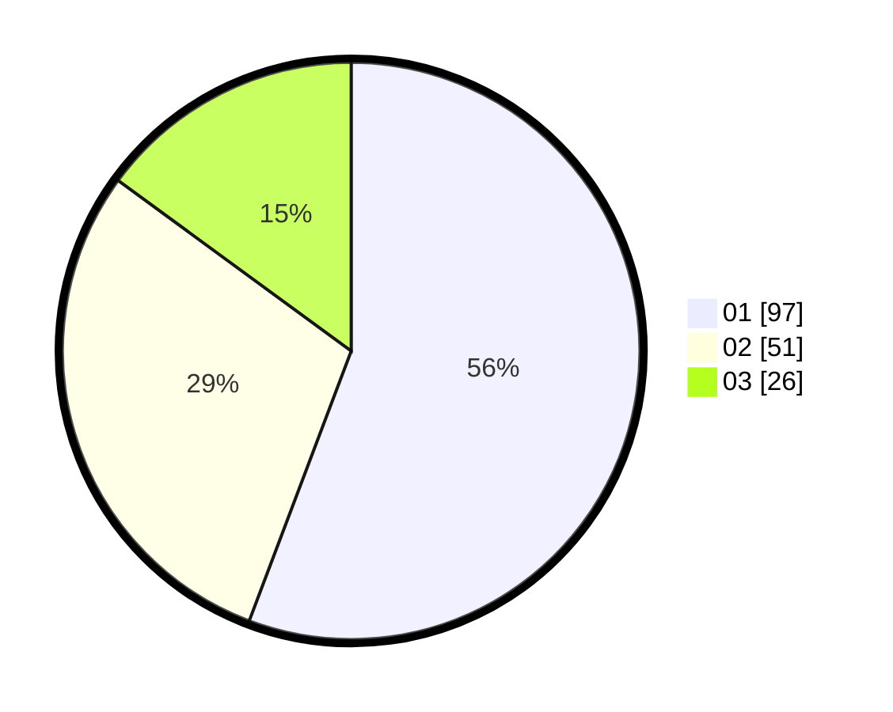

# Hasil

Hasil perolehan suara paslon dapat dilihat pada file paslon-01.txt, paslon-02.txt, dan paslon-03.txt.

Jika tidak ada, artinya data tersebut belum ada pada SIREKAP.

## Perolehan Suara

 * Paslon 01: **97**.
 * Paslon 02: **51**.
 * Paslon 03: **26**.

## Foto C Plano

https://sirekap-obj-formc.kpu.go.id/8b63/pemilu/ppwp/31/73/04/10/02/3173041002012-20240215-023837--704b7361-b074-433b-ae8b-4df82f7d1a44.jpg

https://sirekap-obj-formc.kpu.go.id/8b63/pemilu/ppwp/31/73/04/10/02/3173041002012-20240215-023928--894e6e47-0e64-4bd5-b9f3-80cf7c38b199.jpg

https://sirekap-obj-formc.kpu.go.id/8b63/pemilu/ppwp/31/73/04/10/02/3173041002012-20240215-024013--2ba60187-3f4a-4dc5-9e51-9054a5aadf0d.jpg
