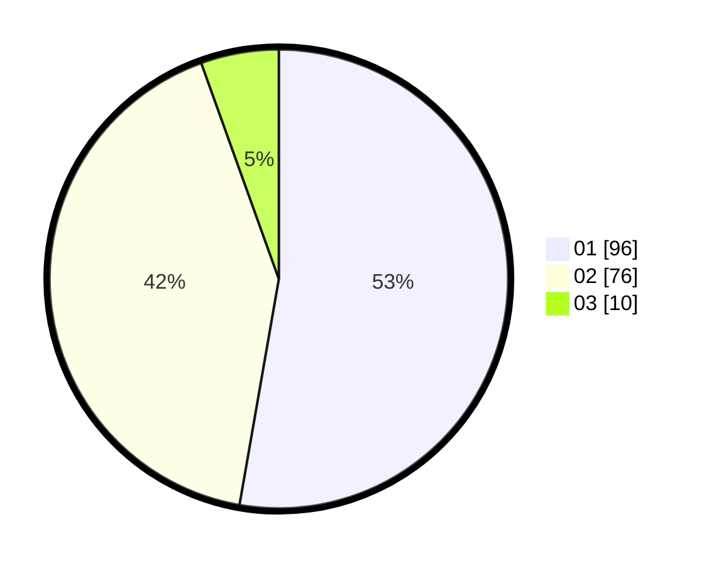

# Hasil

Hasil perolehan suara paslon dapat dilihat pada file paslon-01.txt, paslon-02.txt, dan paslon-03.txt.

Jika tidak ada, artinya data tersebut belum ada pada SIREKAP.

## Perolehan Suara

 * Paslon 01: **96**.
 * Paslon 02: **76**.
 * Paslon 03: **10**.

## Foto C Plano

https://sirekap-obj-formc.kpu.go.id/bbcf/pemilu/ppwp/31/73/04/10/02/3173041002014-20240214-210706--6739f65a-5a51-4d18-afe7-790e71e2dc61.jpg

https://sirekap-obj-formc.kpu.go.id/bbcf/pemilu/ppwp/31/73/04/10/02/3173041002014-20240214-225032--0b4a00c5-2aae-4814-bd12-9ce539718ab7.jpg

https://sirekap-obj-formc.kpu.go.id/bbcf/pemilu/ppwp/31/73/04/10/02/3173041002014-20240214-211005--a0b92bb5-cdfb-42ac-be6c-cbd9b3704d83.jpg

## DATA PEMILIH TETAP

Jumlah pemilih dalam DPT: **270**.
 * L: **147**.
 * P: **123**.

## DATA PENGGUNA HAK PILIH

Jumlah pengguna hak pilih dalam DPT: **183**.
 * L: **91**.
 * P: **92**.

Jumlah pengguna hak pilih dalam DPTb: **0**.
 * L: **0**.
 * P: **0**.

Jumlah pengguna hak pilih dalam DPK: **0**.
 * L: **0**.
 * P: **0**.

Jumlah pengguna hak pilih: **183**.
 * L: **91**.
 * P: **92**.

## JUMLAH SUARA SAH DAN TIDAK SAH

JUMLAH SELURUH SUARA SAH: **182**.

JUMLAH SUARA TIDAK SAH: **1**.

JUMLAH SELURUH SUARA SAH DAN SUARA TIDAK SAH: **183**.
