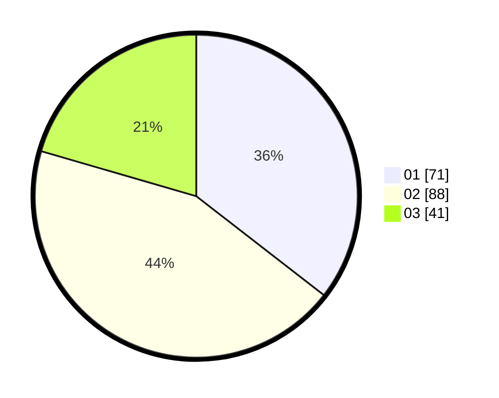

# Hasil

Hasil perolehan suara paslon dapat dilihat pada file paslon-01.txt, paslon-02.txt, dan paslon-03.txt.

Jika tidak ada, artinya data tersebut belum ada pada SIREKAP.

## Perolehan Suara

 * Paslon 01: **71**.
 * Paslon 02: **88**.
 * Paslon 03: **41**.

## Foto C Plano

https://sirekap-obj-formc.kpu.go.id/a88c/pemilu/ppwp/31/73/04/10/02/3173041002019-20240215-200039--dfec4de0-2ca3-4212-92dd-42fd33892fd3.jpg

https://sirekap-obj-formc.kpu.go.id/a88c/pemilu/ppwp/31/73/04/10/02/3173041002019-20240215-200107--939d56e3-e987-487c-a5ad-65ad5d04ccf6.jpg

https://sirekap-obj-formc.kpu.go.id/a88c/pemilu/ppwp/31/73/04/10/02/3173041002019-20240215-200056--bbe517ab-edb6-4cb5-8d4a-60a0de1247ea.jpg

## DATA PEMILIH TETAP

Jumlah pemilih dalam DPT: **288**.
 * L: **155**.
 * P: **133**.

## DATA PENGGUNA HAK PILIH

Jumlah pengguna hak pilih dalam DPT: **201**.
 * L: **102**.
 * P: **99**.

Jumlah pengguna hak pilih dalam DPTb: **0**.
 * L: **0**.
 * P: **0**.

Jumlah pengguna hak pilih dalam DPK: **2**.
 * L: **1**.
 * P: **1**.

Jumlah pengguna hak pilih: **203**.
 * L: **103**.
 * P: **100**.

## JUMLAH SUARA SAH DAN TIDAK SAH

JUMLAH SELURUH SUARA SAH: **200**.

JUMLAH SUARA TIDAK SAH: **3**.

JUMLAH SELURUH SUARA SAH DAN SUARA TIDAK SAH: **203**.
