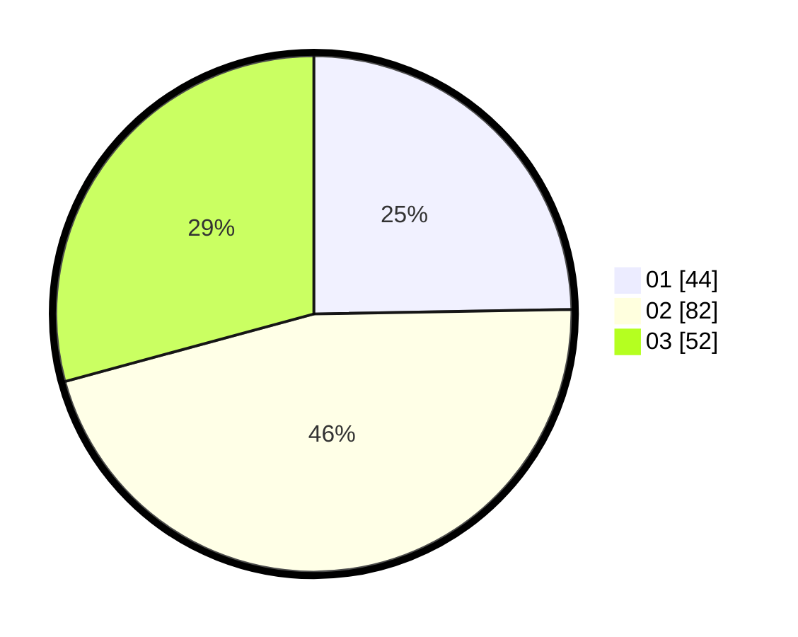

# Hasil

Hasil perolehan suara paslon dapat dilihat pada file paslon-01.txt, paslon-02.txt, dan paslon-03.txt.

Jika tidak ada, artinya data tersebut belum ada pada SIREKAP.

## Perolehan Suara

 * Paslon 01: **44**.
 * Paslon 02: **82**.
 * Paslon 03: **52**.

## Foto C Plano

https://sirekap-obj-formc.kpu.go.id/ae3e/pemilu/ppwp/31/73/04/10/02/3173041002024-20240214-191356--27dd1356-6b58-47d3-9eb6-c7d6eb601b74.jpg

https://sirekap-obj-formc.kpu.go.id/ae3e/pemilu/ppwp/31/73/04/10/02/3173041002024-20240214-195443--3a9c7c92-3065-4f67-94dc-304d57dacdef.jpg

https://sirekap-obj-formc.kpu.go.id/ae3e/pemilu/ppwp/31/73/04/10/02/3173041002024-20240214-195550--4cca97ac-dca4-430c-8142-37cadd16e93a.jpg
