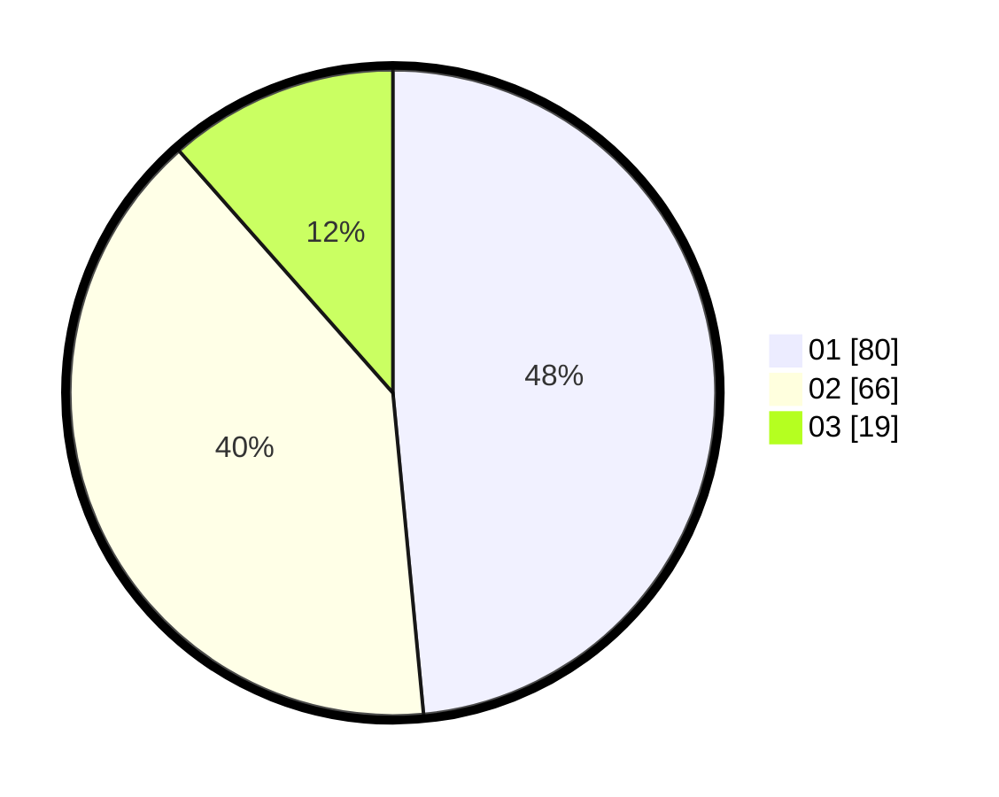

# Hasil

Hasil perolehan suara paslon dapat dilihat pada file paslon-01.txt, paslon-02.txt, dan paslon-03.txt.

Jika tidak ada, artinya data tersebut belum ada pada SIREKAP.

## Perolehan Suara

 * Paslon 01: **80**.
 * Paslon 02: **66**.
 * Paslon 03: **19**.

## Foto C Plano

https://sirekap-obj-formc.kpu.go.id/2120/pemilu/ppwp/31/73/04/10/02/3173041002031-20240215-210401--e6b485a1-e476-4374-bcf9-44f0a8f8ae7b.jpg

https://sirekap-obj-formc.kpu.go.id/2120/pemilu/ppwp/31/73/04/10/02/3173041002031-20240214-195056--65fd266d-d57a-4107-b8d3-1c0cd5f56f31.jpg

https://sirekap-obj-formc.kpu.go.id/2120/pemilu/ppwp/31/73/04/10/02/3173041002031-20240214-195234--385b7aeb-5911-4bbf-95c5-20e4a5836c98.jpg

## DATA PEMILIH TETAP

Jumlah pemilih dalam DPT: **249**.
 * L: **127**.
 * P: **122**.

## DATA PENGGUNA HAK PILIH

Jumlah pengguna hak pilih dalam DPT: **162**.
 * L: **81**.
 * P: **81**.

Jumlah pengguna hak pilih dalam DPTb: **3**.
 * L: **2**.
 * P: **1**.

Jumlah pengguna hak pilih dalam DPK: **0**.
 * L: **0**.
 * P: **0**.

Jumlah pengguna hak pilih: **165**.
 * L: **83**.
 * P: **82**.

## JUMLAH SUARA SAH DAN TIDAK SAH

JUMLAH SELURUH SUARA SAH: **165**.

JUMLAH SUARA TIDAK SAH: **0**.

JUMLAH SELURUH SUARA SAH DAN SUARA TIDAK SAH: **165**.
