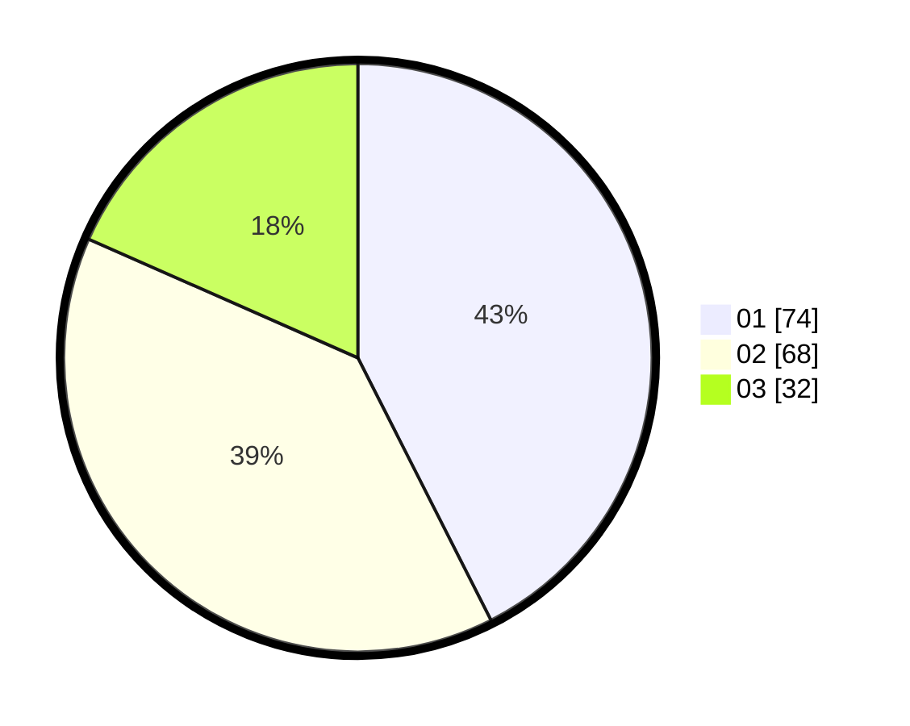

# Hasil

Hasil perolehan suara paslon dapat dilihat pada file paslon-01.txt, paslon-02.txt, dan paslon-03.txt.

Jika tidak ada, artinya data tersebut belum ada pada SIREKAP.

## Perolehan Suara

 * Paslon 01: **74**.
 * Paslon 02: **68**.
 * Paslon 03: **32**.

## Foto C Plano

https://sirekap-obj-formc.kpu.go.id/6b52/pemilu/ppwp/31/73/04/10/02/3173041002033-20240215-214821--57e0819c-ebc2-4946-aeeb-ffc225287a8a.jpg

https://sirekap-obj-formc.kpu.go.id/6b52/pemilu/ppwp/31/73/04/10/02/3173041002033-20240215-214823--ba0a9928-bd81-4852-8d9f-5e2f83f87637.jpg

https://sirekap-obj-formc.kpu.go.id/6b52/pemilu/ppwp/31/73/04/10/02/3173041002033-20240215-214822--f036b6e6-4fa6-47ef-aa28-2ff24436bd60.jpg

## DATA PEMILIH TETAP

Jumlah pemilih dalam DPT: **234**.
 * L: **113**.
 * P: **121**.

## DATA PENGGUNA HAK PILIH

Jumlah pengguna hak pilih dalam DPT: **163**.
 * L: **76**.
 * P: **87**.

Jumlah pengguna hak pilih dalam DPTb: **0**.
 * L: **0**.
 * P: **0**.

Jumlah pengguna hak pilih dalam DPK: **12**.
 * L: **7**.
 * P: **5**.

Jumlah pengguna hak pilih: **175**.
 * L: **83**.
 * P: **92**.

## JUMLAH SUARA SAH DAN TIDAK SAH

JUMLAH SELURUH SUARA SAH: **174**.

JUMLAH SUARA TIDAK SAH: **1**.

JUMLAH SELURUH SUARA SAH DAN SUARA TIDAK SAH: **175**.
