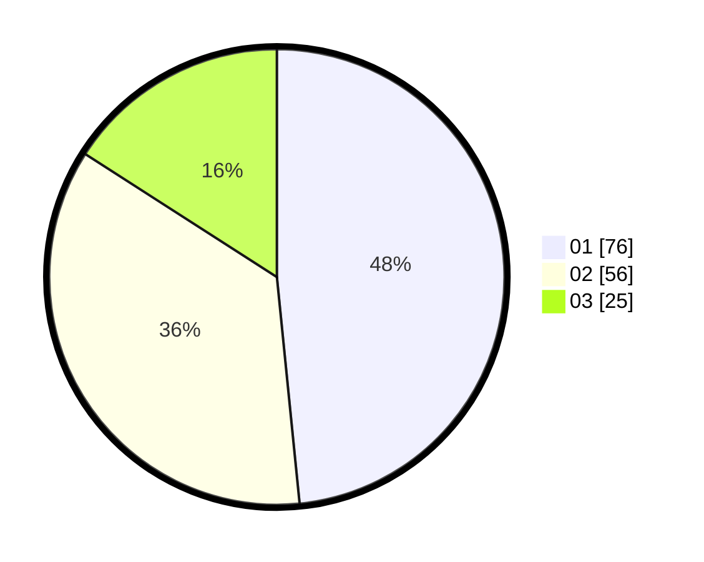

# Hasil

Hasil perolehan suara paslon dapat dilihat pada file paslon-01.txt, paslon-02.txt, dan paslon-03.txt.

Jika tidak ada, artinya data tersebut belum ada pada SIREKAP.

## Perolehan Suara

 * Paslon 01: **76**.
 * Paslon 02: **56**.
 * Paslon 03: **25**.

## Foto C Plano

https://sirekap-obj-formc.kpu.go.id/ef6e/pemilu/ppwp/31/73/04/10/02/3173041002034-20240214-213019--a2069e3c-b310-451e-9e2c-ff808b8ab2ab.jpg

https://sirekap-obj-formc.kpu.go.id/ef6e/pemilu/ppwp/31/73/04/10/02/3173041002034-20240214-213052--db028011-c40e-4528-8d59-9ec77ec42a97.jpg

https://sirekap-obj-formc.kpu.go.id/ef6e/pemilu/ppwp/31/73/04/10/02/3173041002034-20240214-213130--410cf373-a81b-4d14-b2a0-0c5abd13ec30.jpg

## DATA PEMILIH TETAP

Jumlah pemilih dalam DPT: **216**.
 * L: **116**.
 * P: **100**.

## DATA PENGGUNA HAK PILIH

Jumlah pengguna hak pilih dalam DPT: **156**.
 * L: **79**.
 * P: **77**.

Jumlah pengguna hak pilih dalam DPTb: **0**.
 * L: **0**.
 * P: **0**.

Jumlah pengguna hak pilih dalam DPK: **3**.
 * L: **2**.
 * P: **1**.

Jumlah pengguna hak pilih: **359**.
 * L: **87**.
 * P: **78**.

## JUMLAH SUARA SAH DAN TIDAK SAH

JUMLAH SELURUH SUARA SAH: **157**.

JUMLAH SUARA TIDAK SAH: **2**.

JUMLAH SELURUH SUARA SAH DAN SUARA TIDAK SAH: **159**.
