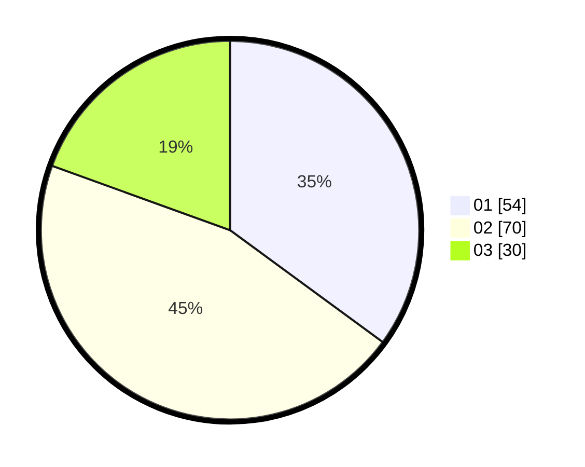

# Hasil

Hasil perolehan suara paslon dapat dilihat pada file paslon-01.txt, paslon-02.txt, dan paslon-03.txt.

Jika tidak ada, artinya data tersebut belum ada pada SIREKAP.

## Perolehan Suara

 * Paslon 01: **54**.
 * Paslon 02: **70**.
 * Paslon 03: **30**.

## Foto C Plano

https://sirekap-obj-formc.kpu.go.id/f8a1/pemilu/ppwp/31/73/04/10/02/3173041002035-20240214-204013--d20956c8-48f8-4171-aded-ee0655d4b588.jpg

https://sirekap-obj-formc.kpu.go.id/f8a1/pemilu/ppwp/31/73/04/10/02/3173041002035-20240214-195330--2bd0edd8-85c2-4783-9e28-4d78dbee0949.jpg

https://sirekap-obj-formc.kpu.go.id/f8a1/pemilu/ppwp/31/73/04/10/02/3173041002035-20240214-204108--f6d2a1b1-f21f-43eb-a42b-0d4316dd860d.jpg

## DATA PEMILIH TETAP

Jumlah pemilih dalam DPT: **200**.
 * L: **99**.
 * P: **101**.

## DATA PENGGUNA HAK PILIH

Jumlah pengguna hak pilih dalam DPT: **155**.
 * L: **82**.
 * P: **73**.

Jumlah pengguna hak pilih dalam DPTb: **0**.
 * L: **0**.
 * P: **0**.

Jumlah pengguna hak pilih dalam DPK: **1**.
 * L: **1**.
 * P: **0**.

Jumlah pengguna hak pilih: **156**.
 * L: **83**.
 * P: **73**.

## JUMLAH SUARA SAH DAN TIDAK SAH

JUMLAH SELURUH SUARA SAH: **154**.

JUMLAH SUARA TIDAK SAH: **2**.

JUMLAH SELURUH SUARA SAH DAN SUARA TIDAK SAH: **156**.
