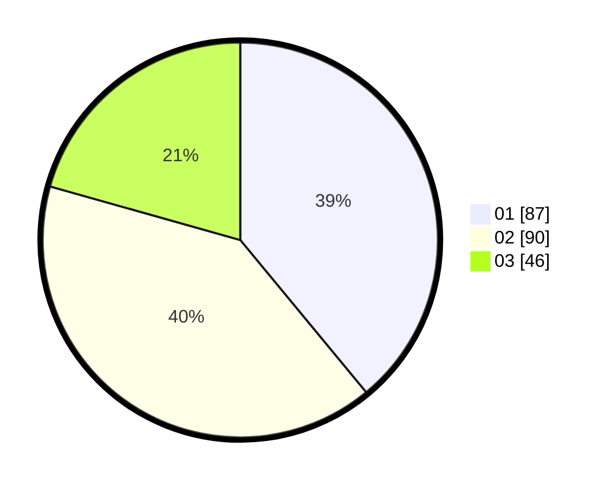

# Hasil

Hasil perolehan suara paslon dapat dilihat pada file paslon-01.txt, paslon-02.txt, dan paslon-03.txt.

Jika tidak ada, artinya data tersebut belum ada pada SIREKAP.

## Perolehan Suara

 * Paslon 01: **87**.
 * Paslon 02: **90**.
 * Paslon 03: **46**.

## Foto C Plano

https://sirekap-obj-formc.kpu.go.id/9aa6/pemilu/ppwp/31/73/04/10/02/3173041002041-20240219-074416--cc9ac99f-befe-4770-8d06-24e1e37d4ef1.jpg

https://sirekap-obj-formc.kpu.go.id/9aa6/pemilu/ppwp/31/73/04/10/02/3173041002041-20240219-074418--788d4a09-0eb2-42f3-ae2b-770aaa307b0d.jpg

https://sirekap-obj-formc.kpu.go.id/9aa6/pemilu/ppwp/31/73/04/10/02/3173041002041-20240219-074417--188bac90-6ee6-43f3-aadc-1828477f4f16.jpg

## DATA PEMILIH TETAP

Jumlah pemilih dalam DPT: **295**.
 * L: **153**.
 * P: **142**.

## DATA PENGGUNA HAK PILIH

Jumlah pengguna hak pilih dalam DPT: **222**.
 * L: **118**.
 * P: **104**.

Jumlah pengguna hak pilih dalam DPTb: **2**.
 * L: **1**.
 * P: **1**.

Jumlah pengguna hak pilih dalam DPK: **0**.
 * L: **0**.
 * P: **0**.

Jumlah pengguna hak pilih: **224**.
 * L: **119**.
 * P: **105**.

## JUMLAH SUARA SAH DAN TIDAK SAH

JUMLAH SELURUH SUARA SAH: **223**.

JUMLAH SUARA TIDAK SAH: **1**.

JUMLAH SELURUH SUARA SAH DAN SUARA TIDAK SAH: **224**.
