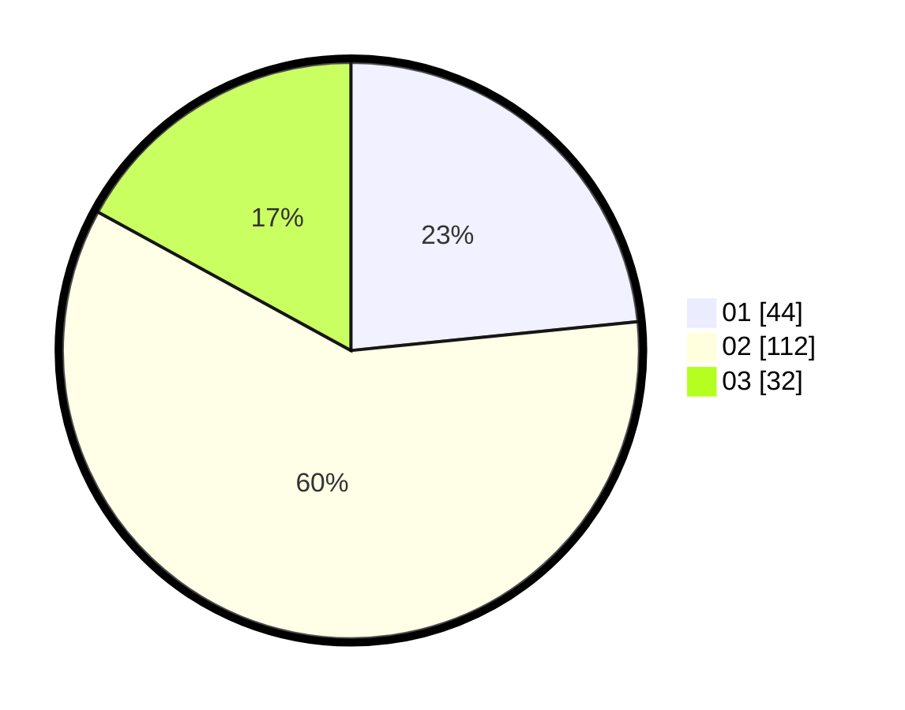

# Hasil

Hasil perolehan suara paslon dapat dilihat pada file paslon-01.txt, paslon-02.txt, dan paslon-03.txt.

Jika tidak ada, artinya data tersebut belum ada pada SIREKAP.

## Perolehan Suara

 * Paslon 01: **44**.
 * Paslon 02: **112**.
 * Paslon 03: **32**.

## Foto C Plano

https://sirekap-obj-formc.kpu.go.id/44d8/pemilu/ppwp/31/73/04/10/02/3173041002045-20240214-222932--d3ef1cff-66c2-4f51-a59d-95f28d5ad3ba.jpg

https://sirekap-obj-formc.kpu.go.id/44d8/pemilu/ppwp/31/73/04/10/02/3173041002045-20240214-223622--fdf9bc97-3f4a-42e3-be78-5d89337f25e2.jpg

https://sirekap-obj-formc.kpu.go.id/44d8/pemilu/ppwp/31/73/04/10/02/3173041002045-20240214-215410--08e1fa52-e13e-4201-8f73-f96d57346f86.jpg
