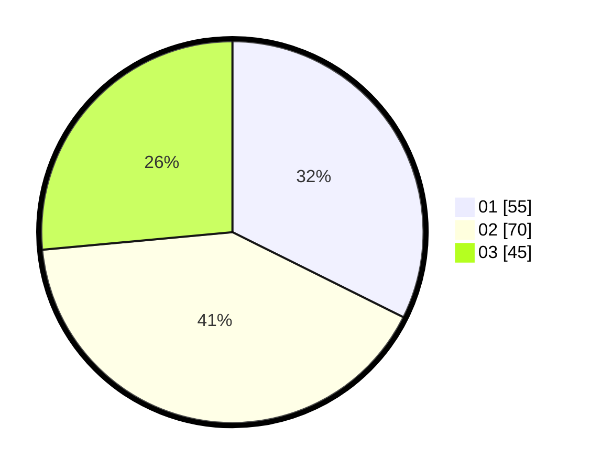

# Hasil

Hasil perolehan suara paslon dapat dilihat pada file paslon-01.txt, paslon-02.txt, dan paslon-03.txt.

Jika tidak ada, artinya data tersebut belum ada pada SIREKAP.

## Perolehan Suara

 * Paslon 01: **55**.
 * Paslon 02: **70**.
 * Paslon 03: **45**.

## Foto C Plano

https://sirekap-obj-formc.kpu.go.id/ea1e/pemilu/ppwp/31/73/04/10/02/3173041002046-20240216-045441--bb3b2e93-634d-4068-be4e-d6e80160c68e.jpg

https://sirekap-obj-formc.kpu.go.id/ea1e/pemilu/ppwp/31/73/04/10/02/3173041002046-20240216-045442--7593bf7a-6637-4cf3-a930-0ae28adf4899.jpg

https://sirekap-obj-formc.kpu.go.id/ea1e/pemilu/ppwp/31/73/04/10/02/3173041002046-20240216-045441--5ef1a461-88bd-4d42-931e-d6cd6a99abd7.jpg

## DATA PEMILIH TETAP

Jumlah pemilih dalam DPT: **244**.
 * L: **139**.
 * P: **105**.

## DATA PENGGUNA HAK PILIH

Jumlah pengguna hak pilih dalam DPT: **176**.
 * L: **97**.
 * P: **79**.

Jumlah pengguna hak pilih dalam DPTb: **2**.
 * L: **2**.
 * P: **0**.

Jumlah pengguna hak pilih dalam DPK: **0**.
 * L: **0**.
 * P: **0**.

Jumlah pengguna hak pilih: **178**.
 * L: **99**.
 * P: **79**.

## JUMLAH SUARA SAH DAN TIDAK SAH

JUMLAH SELURUH SUARA SAH: **170**.

JUMLAH SUARA TIDAK SAH: **8**.

JUMLAH SELURUH SUARA SAH DAN SUARA TIDAK SAH: **178**.
