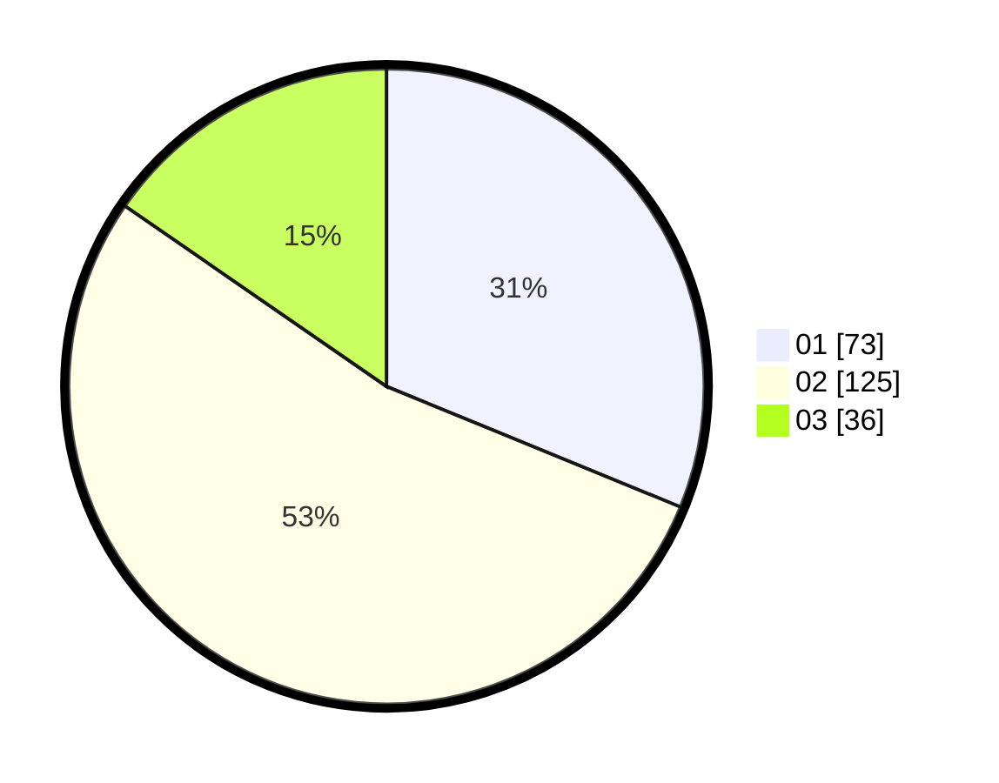

# Hasil

Hasil perolehan suara paslon dapat dilihat pada file paslon-01.txt, paslon-02.txt, dan paslon-03.txt.

Jika tidak ada, artinya data tersebut belum ada pada SIREKAP.

## Perolehan Suara

 * Paslon 01: **73**.
 * Paslon 02: **125**.
 * Paslon 03: **36**.

## Foto C Plano

https://sirekap-obj-formc.kpu.go.id/4645/pemilu/ppwp/31/73/04/10/02/3173041002047-20240216-152008--486af799-6a67-4141-87c5-b176ca6c029b.jpg

https://sirekap-obj-formc.kpu.go.id/4645/pemilu/ppwp/31/73/04/10/02/3173041002047-20240216-152009--eda5de60-1f96-4838-a6b0-6f512c400903.jpg

https://sirekap-obj-formc.kpu.go.id/4645/pemilu/ppwp/31/73/04/10/02/3173041002047-20240216-152008--608ca17f-d3aa-4f59-a132-29ffeb4d05ce.jpg

## DATA PEMILIH TETAP

Jumlah pemilih dalam DPT: **284**.
 * L: **146**.
 * P: **138**.

## DATA PENGGUNA HAK PILIH

Jumlah pengguna hak pilih dalam DPT: **237**.
 * L: **125**.
 * P: **112**.

Jumlah pengguna hak pilih dalam DPTb: **0**.
 * L: **0**.
 * P: **0**.

Jumlah pengguna hak pilih dalam DPK: **2**.
 * L: **2**.
 * P: **0**.

Jumlah pengguna hak pilih: **239**.
 * L: **127**.
 * P: **112**.

## JUMLAH SUARA SAH DAN TIDAK SAH

JUMLAH SELURUH SUARA SAH: **234**.

JUMLAH SUARA TIDAK SAH: **5**.

JUMLAH SELURUH SUARA SAH DAN SUARA TIDAK SAH: **239**.
