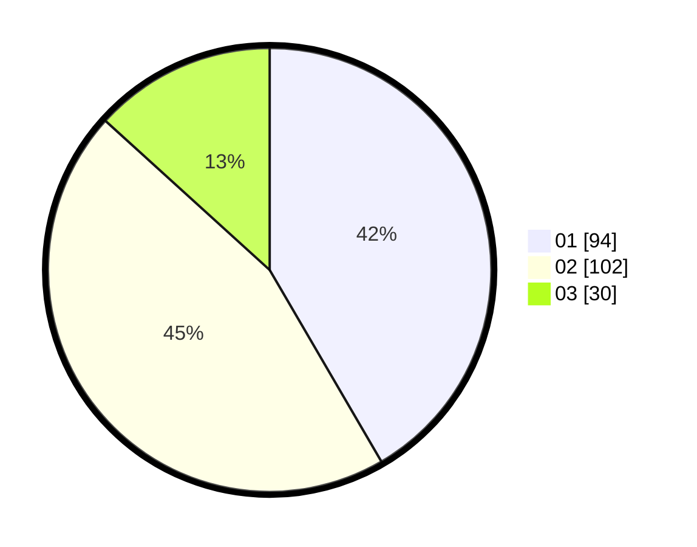

# Hasil

Hasil perolehan suara paslon dapat dilihat pada file paslon-01.txt, paslon-02.txt, dan paslon-03.txt.

Jika tidak ada, artinya data tersebut belum ada pada SIREKAP.

## Perolehan Suara

 * Paslon 01: **94**.
 * Paslon 02: **102**.
 * Paslon 03: **30**.

## Foto C Plano

https://sirekap-obj-formc.kpu.go.id/baff/pemilu/ppwp/31/73/04/10/02/3173041002048-20240216-153843--e4f58d27-8e47-49f1-aefa-4810087ad3de.jpg

https://sirekap-obj-formc.kpu.go.id/baff/pemilu/ppwp/31/73/04/10/02/3173041002048-20240216-153845--f13a0c2d-a295-4ba4-8360-1ae98834b02a.jpg

https://sirekap-obj-formc.kpu.go.id/baff/pemilu/ppwp/31/73/04/10/02/3173041002048-20240216-153844--fdf967f9-5d44-4560-90d9-4e54f8231c94.jpg

## DATA PEMILIH TETAP

Jumlah pemilih dalam DPT: **286**.
 * L: **141**.
 * P: **145**.

## DATA PENGGUNA HAK PILIH

Jumlah pengguna hak pilih dalam DPT: **231**.
 * L: **110**.
 * P: **121**.

Jumlah pengguna hak pilih dalam DPTb: **0**.
 * L: **0**.
 * P: **0**.

Jumlah pengguna hak pilih dalam DPK: **1**.
 * L: **0**.
 * P: **1**.

Jumlah pengguna hak pilih: **232**.
 * L: **110**.
 * P: **122**.

## JUMLAH SUARA SAH DAN TIDAK SAH

JUMLAH SELURUH SUARA SAH: **226**.

JUMLAH SUARA TIDAK SAH: **6**.

JUMLAH SELURUH SUARA SAH DAN SUARA TIDAK SAH: **232**.
