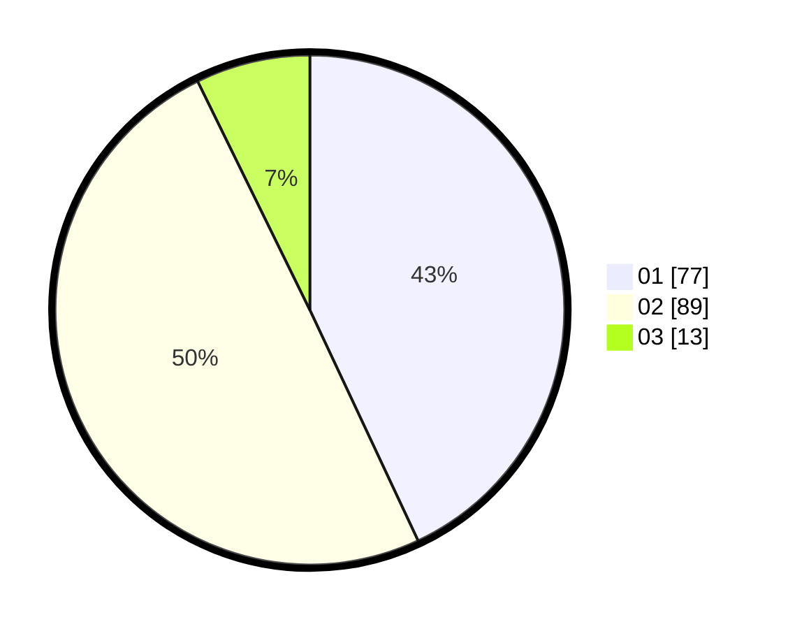

# Hasil

Hasil perolehan suara paslon dapat dilihat pada file paslon-01.txt, paslon-02.txt, dan paslon-03.txt.

Jika tidak ada, artinya data tersebut belum ada pada SIREKAP.

## Perolehan Suara

 * Paslon 01: **77**.
 * Paslon 02: **89**.
 * Paslon 03: **13**.

## Foto C Plano

https://sirekap-obj-formc.kpu.go.id/e398/pemilu/ppwp/31/73/04/10/02/3173041002049-20240214-191054--edb3dd39-b37d-4bcc-a156-42f575917f87.jpg

https://sirekap-obj-formc.kpu.go.id/e398/pemilu/ppwp/31/73/04/10/02/3173041002049-20240214-195310--859b3180-dc46-437a-9b5f-a9dc85a40c69.jpg

https://sirekap-obj-formc.kpu.go.id/e398/pemilu/ppwp/31/73/04/10/02/3173041002049-20240214-195521--ece5ea0e-fa18-4489-93c6-cdb38b23976c.jpg

## DATA PEMILIH TETAP

Jumlah pemilih dalam DPT: **266**.
 * L: **135**.
 * P: **131**.

## DATA PENGGUNA HAK PILIH

Jumlah pengguna hak pilih dalam DPT: **181**.
 * L: **94**.
 * P: **87**.

Jumlah pengguna hak pilih dalam DPTb: **0**.
 * L: **0**.
 * P: **0**.

Jumlah pengguna hak pilih dalam DPK: **1**.
 * L: **0**.
 * P: **1**.

Jumlah pengguna hak pilih: **182**.
 * L: **94**.
 * P: **88**.

## JUMLAH SUARA SAH DAN TIDAK SAH

JUMLAH SELURUH SUARA SAH: **179**.

JUMLAH SUARA TIDAK SAH: **3**.

JUMLAH SELURUH SUARA SAH DAN SUARA TIDAK SAH: **182**.
