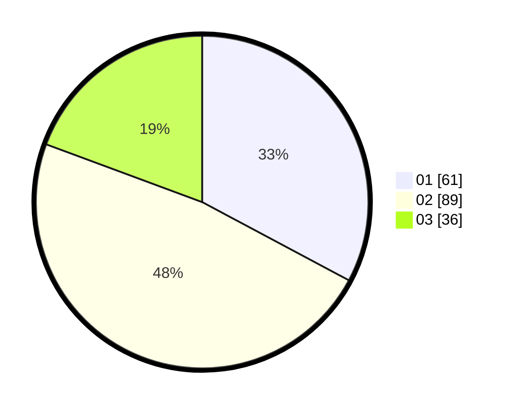

# Hasil

Hasil perolehan suara paslon dapat dilihat pada file paslon-01.txt, paslon-02.txt, dan paslon-03.txt.

Jika tidak ada, artinya data tersebut belum ada pada SIREKAP.

## Perolehan Suara

 * Paslon 01: **61**.
 * Paslon 02: **89**.
 * Paslon 03: **36**.

## Foto C Plano

https://sirekap-obj-formc.kpu.go.id/65ff/pemilu/ppwp/31/73/04/10/02/3173041002055-20240216-050424--6e95d120-fd42-46c9-9efb-480bb841410c.jpg

https://sirekap-obj-formc.kpu.go.id/65ff/pemilu/ppwp/31/73/04/10/02/3173041002055-20240216-050426--5dc0c5a2-2760-43ce-9f92-5bd89e95a3e4.jpg

https://sirekap-obj-formc.kpu.go.id/65ff/pemilu/ppwp/31/73/04/10/02/3173041002055-20240216-050425--f82af77d-7966-45ff-a348-f3ab1b8ddf92.jpg

## DATA PEMILIH TETAP

Jumlah pemilih dalam DPT: **286**.
 * L: **156**.
 * P: **130**.

## DATA PENGGUNA HAK PILIH

Jumlah pengguna hak pilih dalam DPT: **180**.
 * L: **100**.
 * P: **80**.

Jumlah pengguna hak pilih dalam DPTb: **2**.
 * L: **1**.
 * P: **1**.

Jumlah pengguna hak pilih dalam DPK: **8**.
 * L: **2**.
 * P: **6**.

Jumlah pengguna hak pilih: **190**.
 * L: **103**.
 * P: **87**.

## JUMLAH SUARA SAH DAN TIDAK SAH

JUMLAH SELURUH SUARA SAH: **186**.

JUMLAH SUARA TIDAK SAH: **4**.

JUMLAH SELURUH SUARA SAH DAN SUARA TIDAK SAH: **190**.
