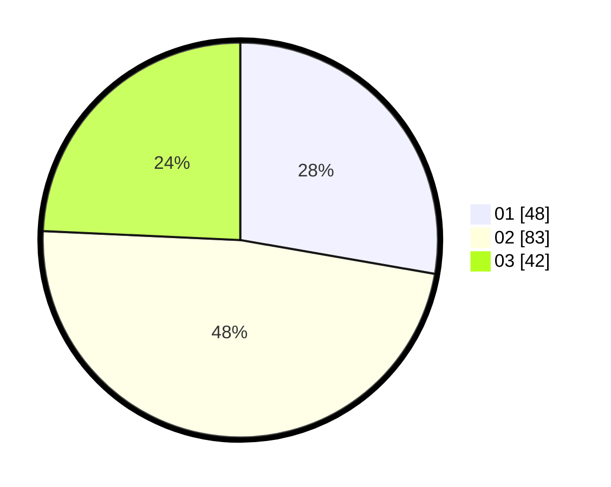

# Hasil

Hasil perolehan suara paslon dapat dilihat pada file paslon-01.txt, paslon-02.txt, dan paslon-03.txt.

Jika tidak ada, artinya data tersebut belum ada pada SIREKAP.

## Perolehan Suara

 * Paslon 01: **48**.
 * Paslon 02: **83**.
 * Paslon 03: **42**.

## Foto C Plano

https://sirekap-obj-formc.kpu.go.id/a274/pemilu/ppwp/31/73/04/10/02/3173041002058-20240215-000112--7df5070b-8343-4d5e-b37b-6010d210e008.jpg

https://sirekap-obj-formc.kpu.go.id/a274/pemilu/ppwp/31/73/04/10/02/3173041002058-20240215-000121--79c55750-3dda-4d15-8f19-fb32b1e4fa69.jpg

https://sirekap-obj-formc.kpu.go.id/a274/pemilu/ppwp/31/73/04/10/02/3173041002058-20240214-220517--004ad385-3d50-4c71-bd12-b29573acb7e8.jpg
