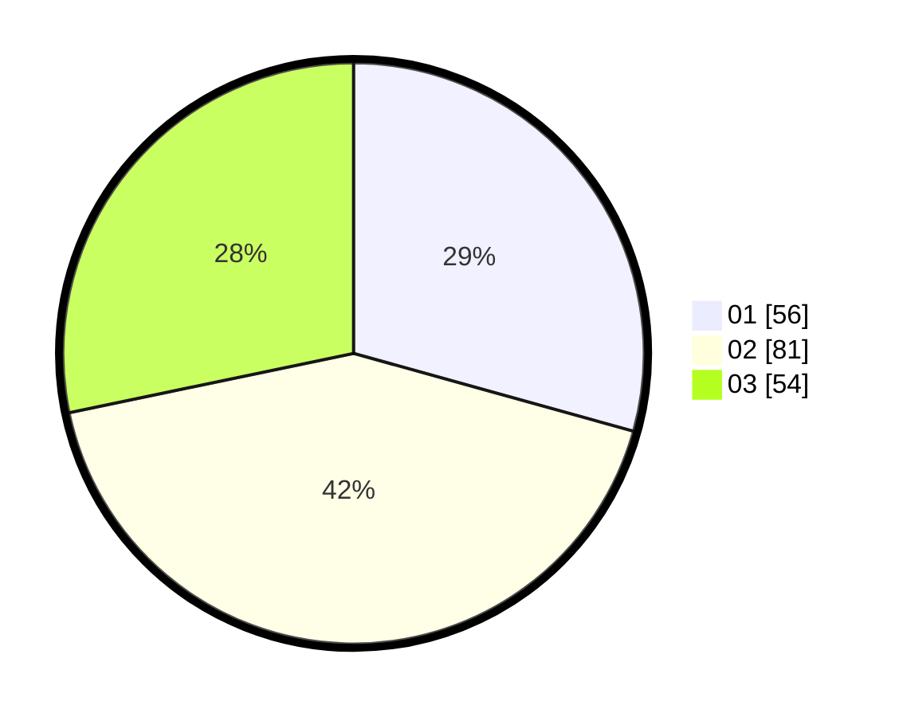

# Hasil

Hasil perolehan suara paslon dapat dilihat pada file paslon-01.txt, paslon-02.txt, dan paslon-03.txt.

Jika tidak ada, artinya data tersebut belum ada pada SIREKAP.

## Perolehan Suara

 * Paslon 01: **56**.
 * Paslon 02: **81**.
 * Paslon 03: **54**.

## Foto C Plano

https://sirekap-obj-formc.kpu.go.id/a53f/pemilu/ppwp/31/73/04/10/02/3173041002063-20240214-200016--f53eb2cb-47f7-4fda-9fde-0148a0a20b0d.jpg

https://sirekap-obj-formc.kpu.go.id/a53f/pemilu/ppwp/31/73/04/10/02/3173041002063-20240214-200025--5c22ac7b-21e6-4bab-ba6f-443c9ef1b16e.jpg

https://sirekap-obj-formc.kpu.go.id/a53f/pemilu/ppwp/31/73/04/10/02/3173041002063-20240214-200028--8671d27f-ef6e-4283-9807-42da08d1b237.jpg

## DATA PEMILIH TETAP

Jumlah pemilih dalam DPT: **274**.
 * L: **143**.
 * P: **131**.

## DATA PENGGUNA HAK PILIH

Jumlah pengguna hak pilih dalam DPT: **192**.
 * L: **95**.
 * P: **97**.

Jumlah pengguna hak pilih dalam DPTb: **1**.
 * L: **0**.
 * P: **1**.

Jumlah pengguna hak pilih dalam DPK: **2**.
 * L: **0**.
 * P: **2**.

Jumlah pengguna hak pilih: **195**.
 * L: **95**.
 * P: **100**.

## JUMLAH SUARA SAH DAN TIDAK SAH

JUMLAH SELURUH SUARA SAH: **191**.

JUMLAH SUARA TIDAK SAH: **4**.

JUMLAH SELURUH SUARA SAH DAN SUARA TIDAK SAH: **195**.
