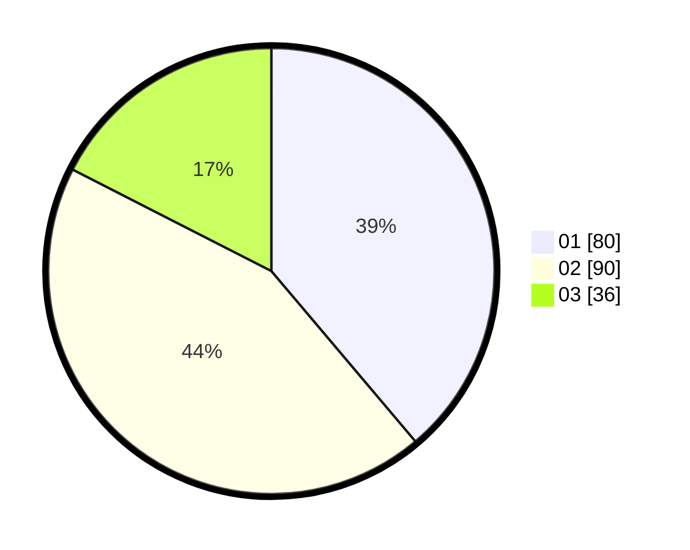

# Hasil

Hasil perolehan suara paslon dapat dilihat pada file paslon-01.txt, paslon-02.txt, dan paslon-03.txt.

Jika tidak ada, artinya data tersebut belum ada pada SIREKAP.

## Perolehan Suara

 * Paslon 01: **80**.
 * Paslon 02: **90**.
 * Paslon 03: **36**.

## Foto C Plano

https://sirekap-obj-formc.kpu.go.id/ebec/pemilu/ppwp/31/73/04/10/02/3173041002066-20240216-152005--87fc6bab-068e-4df9-9ac3-92e0e6df6ba4.jpg

https://sirekap-obj-formc.kpu.go.id/ebec/pemilu/ppwp/31/73/04/10/02/3173041002066-20240216-152006--c521b233-a705-42df-95d6-66adb8515b3b.jpg

https://sirekap-obj-formc.kpu.go.id/ebec/pemilu/ppwp/31/73/04/10/02/3173041002066-20240216-152005--f36bd953-0f94-4b59-babf-a96002c4ed47.jpg

## DATA PEMILIH TETAP

Jumlah pemilih dalam DPT: **288**.
 * L: **139**.
 * P: **149**.

## DATA PENGGUNA HAK PILIH

Jumlah pengguna hak pilih dalam DPT: **212**.
 * L: **107**.
 * P: **105**.

Jumlah pengguna hak pilih dalam DPTb: **2**.
 * L: **2**.
 * P: **0**.

Jumlah pengguna hak pilih dalam DPK: **2**.
 * L: **1**.
 * P: **1**.

Jumlah pengguna hak pilih: **216**.
 * L: **110**.
 * P: **106**.

## JUMLAH SUARA SAH DAN TIDAK SAH

JUMLAH SELURUH SUARA SAH: **206**.

JUMLAH SUARA TIDAK SAH: **10**.

JUMLAH SELURUH SUARA SAH DAN SUARA TIDAK SAH: **216**.
