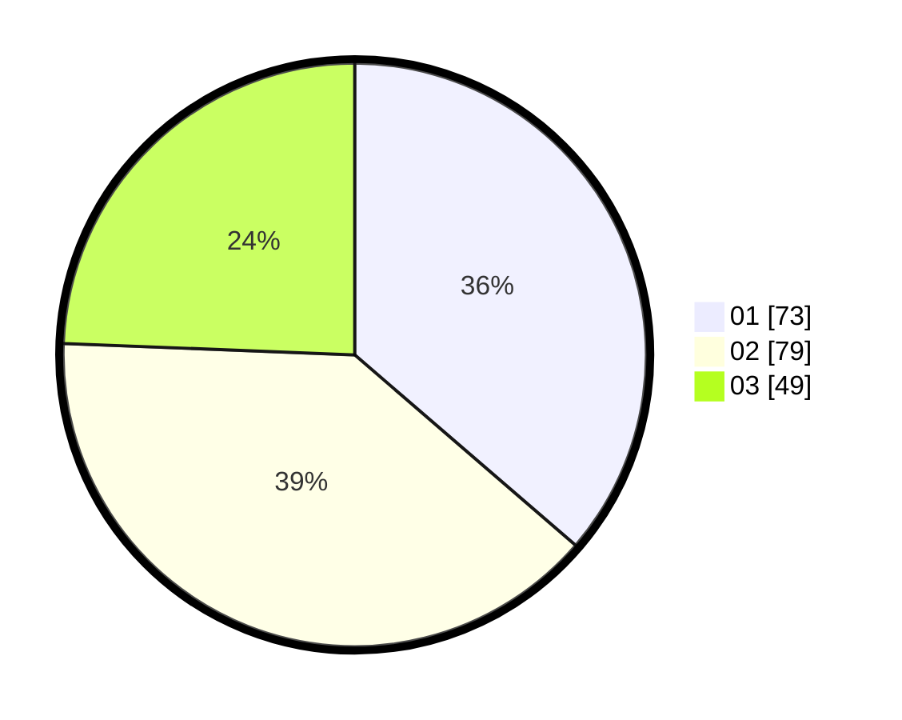

# Hasil

Hasil perolehan suara paslon dapat dilihat pada file paslon-01.txt, paslon-02.txt, dan paslon-03.txt.

Jika tidak ada, artinya data tersebut belum ada pada SIREKAP.

## Perolehan Suara

 * Paslon 01: **73**.
 * Paslon 02: **79**.
 * Paslon 03: **49**.

## Foto C Plano

https://sirekap-obj-formc.kpu.go.id/760c/pemilu/ppwp/31/73/04/10/02/3173041002068-20240214-191756--d47a90ff-653f-4c5d-ad28-427f03d5b0b4.jpg

https://sirekap-obj-formc.kpu.go.id/760c/pemilu/ppwp/31/73/04/10/02/3173041002068-20240214-201830--d0a54269-a84e-4b0a-91bd-aa9e26466ee3.jpg

https://sirekap-obj-formc.kpu.go.id/760c/pemilu/ppwp/31/73/04/10/02/3173041002068-20240214-203444--d3d434cc-295b-4a55-81d3-ba4838f622cf.jpg

## DATA PEMILIH TETAP

Jumlah pemilih dalam DPT: **274**.
 * L: **136**.
 * P: **138**.

## DATA PENGGUNA HAK PILIH

Jumlah pengguna hak pilih dalam DPT: **202**.
 * L: **98**.
 * P: **104**.

Jumlah pengguna hak pilih dalam DPTb: **0**.
 * L: **0**.
 * P: **0**.

Jumlah pengguna hak pilih dalam DPK: **2**.
 * L: **1**.
 * P: **0**.

Jumlah pengguna hak pilih: **203**.
 * L: **99**.
 * P: **104**.

## JUMLAH SUARA SAH DAN TIDAK SAH

JUMLAH SELURUH SUARA SAH: **201**.

JUMLAH SUARA TIDAK SAH: **2**.

JUMLAH SELURUH SUARA SAH DAN SUARA TIDAK SAH: **203**.
