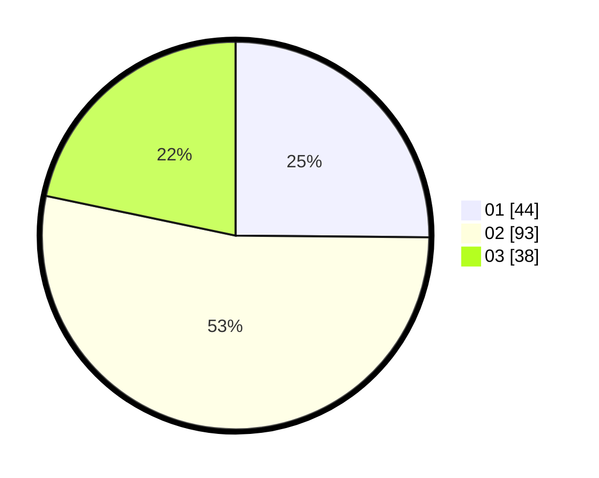

# Hasil

Hasil perolehan suara paslon dapat dilihat pada file paslon-01.txt, paslon-02.txt, dan paslon-03.txt.

Jika tidak ada, artinya data tersebut belum ada pada SIREKAP.

## Perolehan Suara

 * Paslon 01: **44**.
 * Paslon 02: **93**.
 * Paslon 03: **38**.

## Foto C Plano

https://sirekap-obj-formc.kpu.go.id/0dbb/pemilu/ppwp/31/73/04/10/02/3173041002069-20240214-155646--728b7eb0-3925-4c68-9355-f84cae495d73.jpg

https://sirekap-obj-formc.kpu.go.id/0dbb/pemilu/ppwp/31/73/04/10/02/3173041002069-20240214-160056--d77b4311-78a7-40b9-874d-978d6d82d286.jpg

https://sirekap-obj-formc.kpu.go.id/0dbb/pemilu/ppwp/31/73/04/10/02/3173041002069-20240214-160139--56e35c5c-acf4-486b-966d-361e9339316a.jpg

## DATA PEMILIH TETAP

Jumlah pemilih dalam DPT: **256**.
 * L: **136**.
 * P: **129**.

## DATA PENGGUNA HAK PILIH

Jumlah pengguna hak pilih dalam DPT: **176**.
 * L: **84**.
 * P: **92**.

Jumlah pengguna hak pilih dalam DPTb: **0**.
 * L: **0**.
 * P: **0**.

Jumlah pengguna hak pilih dalam DPK: **1**.
 * L: **1**.
 * P: **0**.

Jumlah pengguna hak pilih: **177**.
 * L: **85**.
 * P: **92**.

## JUMLAH SUARA SAH DAN TIDAK SAH

JUMLAH SELURUH SUARA SAH: **175**.

JUMLAH SUARA TIDAK SAH: **2**.

JUMLAH SELURUH SUARA SAH DAN SUARA TIDAK SAH: **177**.
