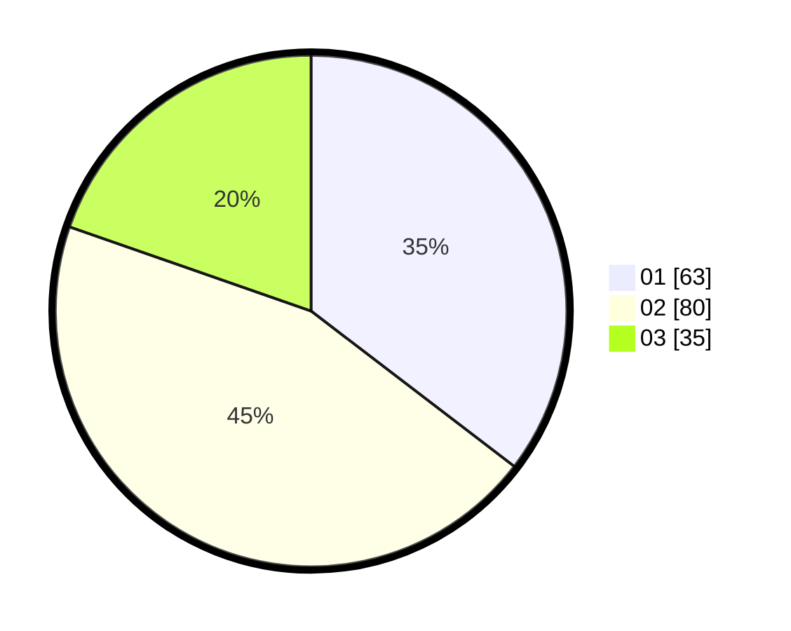

# Hasil

Hasil perolehan suara paslon dapat dilihat pada file paslon-01.txt, paslon-02.txt, dan paslon-03.txt.

Jika tidak ada, artinya data tersebut belum ada pada SIREKAP.

## Perolehan Suara

 * Paslon 01: **63**.
 * Paslon 02: **80**.
 * Paslon 03: **35**.

## Foto C Plano

https://sirekap-obj-formc.kpu.go.id/12df/pemilu/ppwp/31/73/04/10/02/3173041002070-20240214-220823--ed90f437-04e7-4832-8af7-eb5d1a44eb3f.jpg

https://sirekap-obj-formc.kpu.go.id/12df/pemilu/ppwp/31/73/04/10/02/3173041002070-20240214-220924--57089c03-1a15-44ce-ad95-1816b683d7f8.jpg

https://sirekap-obj-formc.kpu.go.id/12df/pemilu/ppwp/31/73/04/10/02/3173041002070-20240214-221014--cf01ee31-930f-476d-a718-4f4b3a4741d3.jpg
