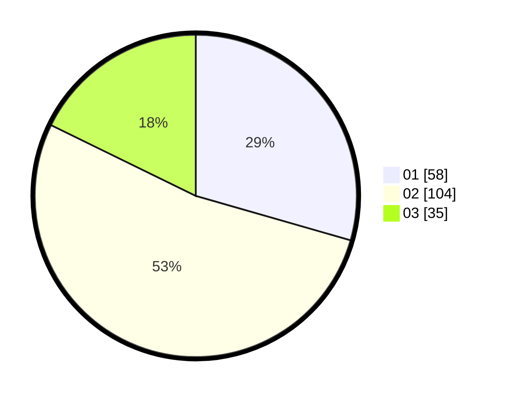

# Hasil

Hasil perolehan suara paslon dapat dilihat pada file paslon-01.txt, paslon-02.txt, dan paslon-03.txt.

Jika tidak ada, artinya data tersebut belum ada pada SIREKAP.

## Perolehan Suara

 * Paslon 01: **58**.
 * Paslon 02: **104**.
 * Paslon 03: **35**.

## Foto C Plano

https://sirekap-obj-formc.kpu.go.id/a052/pemilu/ppwp/31/73/04/10/02/3173041002073-20240215-040413--ebdc4fb6-5954-49c7-93bb-32abd4f7426e.jpg

https://sirekap-obj-formc.kpu.go.id/a052/pemilu/ppwp/31/73/04/10/02/3173041002073-20240215-022801--272544dc-654d-4d5a-9260-dfe633d345c9.jpg

https://sirekap-obj-formc.kpu.go.id/a052/pemilu/ppwp/31/73/04/10/02/3173041002073-20240215-022708--9d9e1f67-58a0-4f7c-8aed-3adf96ba7163.jpg
