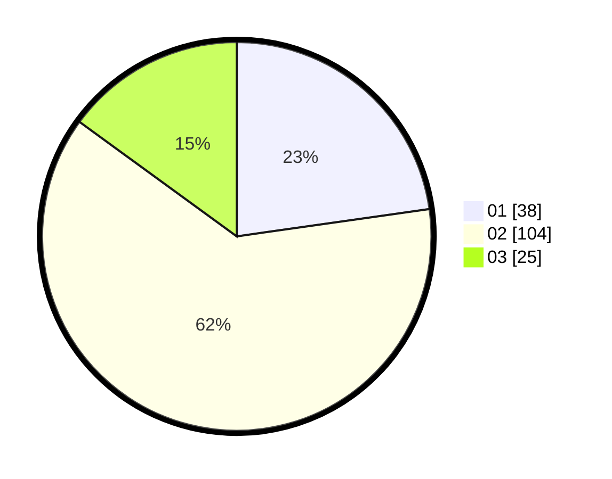

# Hasil

Hasil perolehan suara paslon dapat dilihat pada file paslon-01.txt, paslon-02.txt, dan paslon-03.txt.

Jika tidak ada, artinya data tersebut belum ada pada SIREKAP.

## Perolehan Suara

 * Paslon 01: **38**.
 * Paslon 02: **104**.
 * Paslon 03: **25**.

## Foto C Plano

https://sirekap-obj-formc.kpu.go.id/0c95/pemilu/ppwp/31/73/04/10/02/3173041002077-20240214-195003--a1151947-2243-4122-8dcf-a9005dfc7538.jpg

https://sirekap-obj-formc.kpu.go.id/0c95/pemilu/ppwp/31/73/04/10/02/3173041002077-20240214-195010--86a94c96-c41f-46e9-93b6-5d1befea0fd8.jpg

https://sirekap-obj-formc.kpu.go.id/0c95/pemilu/ppwp/31/73/04/10/02/3173041002077-20240214-195014--95201570-18d4-4abb-8369-252facb4c998.jpg

## DATA PEMILIH TETAP

Jumlah pemilih dalam DPT: **212**.
 * L: **106**.
 * P: **106**.

## DATA PENGGUNA HAK PILIH

Jumlah pengguna hak pilih dalam DPT: **168**.
 * L: **78**.
 * P: **90**.

Jumlah pengguna hak pilih dalam DPTb: **3**.
 * L: **2**.
 * P: **1**.

Jumlah pengguna hak pilih dalam DPK: **2**.
 * L: **1**.
 * P: **1**.

Jumlah pengguna hak pilih: **173**.
 * L: **81**.
 * P: **92**.

## JUMLAH SUARA SAH DAN TIDAK SAH

JUMLAH SELURUH SUARA SAH: **167**.

JUMLAH SUARA TIDAK SAH: **6**.

JUMLAH SELURUH SUARA SAH DAN SUARA TIDAK SAH: **173**.
