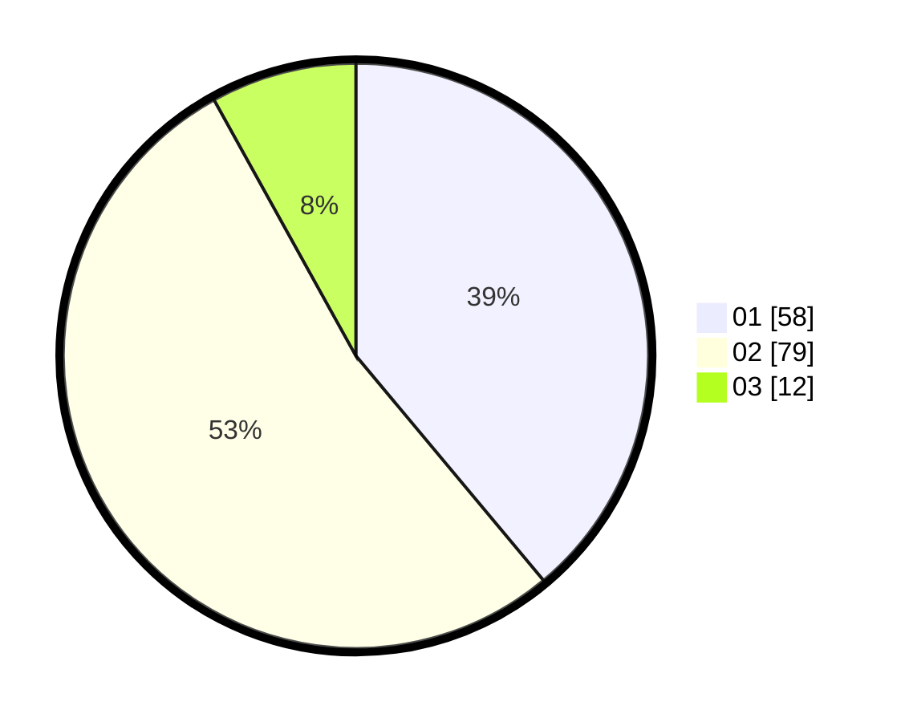

# Hasil

Hasil perolehan suara paslon dapat dilihat pada file paslon-01.txt, paslon-02.txt, dan paslon-03.txt.

Jika tidak ada, artinya data tersebut belum ada pada SIREKAP.

## Perolehan Suara

 * Paslon 01: **58**.
 * Paslon 02: **79**.
 * Paslon 03: **12**.

## Foto C Plano

https://sirekap-obj-formc.kpu.go.id/7c90/pemilu/ppwp/31/73/04/10/02/3173041002079-20240214-155038--e5451708-9e40-419d-8761-3786643817e4.jpg

https://sirekap-obj-formc.kpu.go.id/7c90/pemilu/ppwp/31/73/04/10/02/3173041002079-20240214-155138--f35914a4-3103-41cb-8607-6a7ed3754b47.jpg

https://sirekap-obj-formc.kpu.go.id/7c90/pemilu/ppwp/31/73/04/10/02/3173041002079-20240214-155204--b9549337-1757-43c1-84c3-0d7f3f8148f4.jpg

## DATA PEMILIH TETAP

Jumlah pemilih dalam DPT: **201**.
 * L: **105**.
 * P: **96**.

## DATA PENGGUNA HAK PILIH

Jumlah pengguna hak pilih dalam DPT: **149**.
 * L: **76**.
 * P: **73**.

Jumlah pengguna hak pilih dalam DPTb: **1**.
 * L: **0**.
 * P: **1**.

Jumlah pengguna hak pilih dalam DPK: **2**.
 * L: **1**.
 * P: **1**.

Jumlah pengguna hak pilih: **152**.
 * L: **77**.
 * P: **75**.

## JUMLAH SUARA SAH DAN TIDAK SAH

JUMLAH SELURUH SUARA SAH: **149**.

JUMLAH SUARA TIDAK SAH: **3**.

JUMLAH SELURUH SUARA SAH DAN SUARA TIDAK SAH: **152**.
