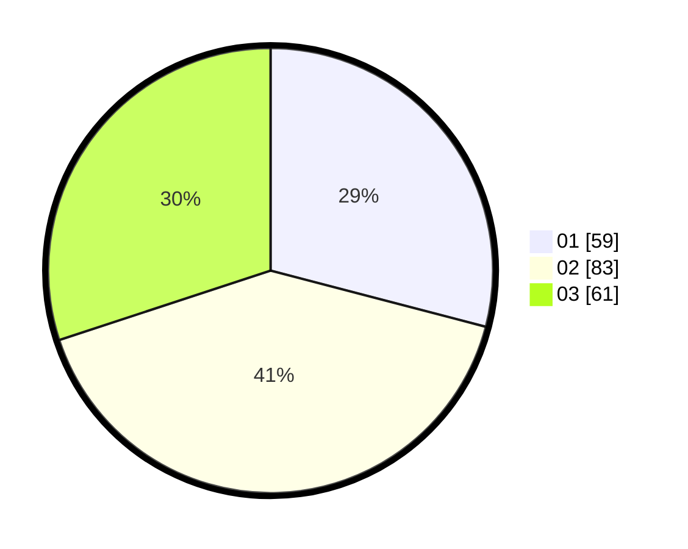

# Hasil

Hasil perolehan suara paslon dapat dilihat pada file paslon-01.txt, paslon-02.txt, dan paslon-03.txt.

Jika tidak ada, artinya data tersebut belum ada pada SIREKAP.

## Perolehan Suara

 * Paslon 01: **59**.
 * Paslon 02: **83**.
 * Paslon 03: **61**.

## Foto C Plano

https://sirekap-obj-formc.kpu.go.id/7674/pemilu/ppwp/31/73/04/10/02/3173041002080-20240216-120751--5c24a81a-517c-497f-a008-5174d80faf75.jpg

https://sirekap-obj-formc.kpu.go.id/7674/pemilu/ppwp/31/73/04/10/02/3173041002080-20240216-120755--e787cb91-b4d6-4f12-9f5d-d0eae619b8ea.jpg

https://sirekap-obj-formc.kpu.go.id/7674/pemilu/ppwp/31/73/04/10/02/3173041002080-20240214-184349--72694b3f-c876-480c-86d1-15c86f63fd47.jpg

## DATA PEMILIH TETAP

Jumlah pemilih dalam DPT: **276**.
 * L: **132**.
 * P: **144**.

## DATA PENGGUNA HAK PILIH

Jumlah pengguna hak pilih dalam DPT: **201**.
 * L: **90**.
 * P: **111**.

Jumlah pengguna hak pilih dalam DPTb: **5**.
 * L: **3**.
 * P: **2**.

Jumlah pengguna hak pilih dalam DPK: **0**.
 * L: **0**.
 * P: **0**.

Jumlah pengguna hak pilih: **206**.
 * L: **93**.
 * P: **113**.

## JUMLAH SUARA SAH DAN TIDAK SAH

JUMLAH SELURUH SUARA SAH: **203**.

JUMLAH SUARA TIDAK SAH: **3**.

JUMLAH SELURUH SUARA SAH DAN SUARA TIDAK SAH: **206**.
