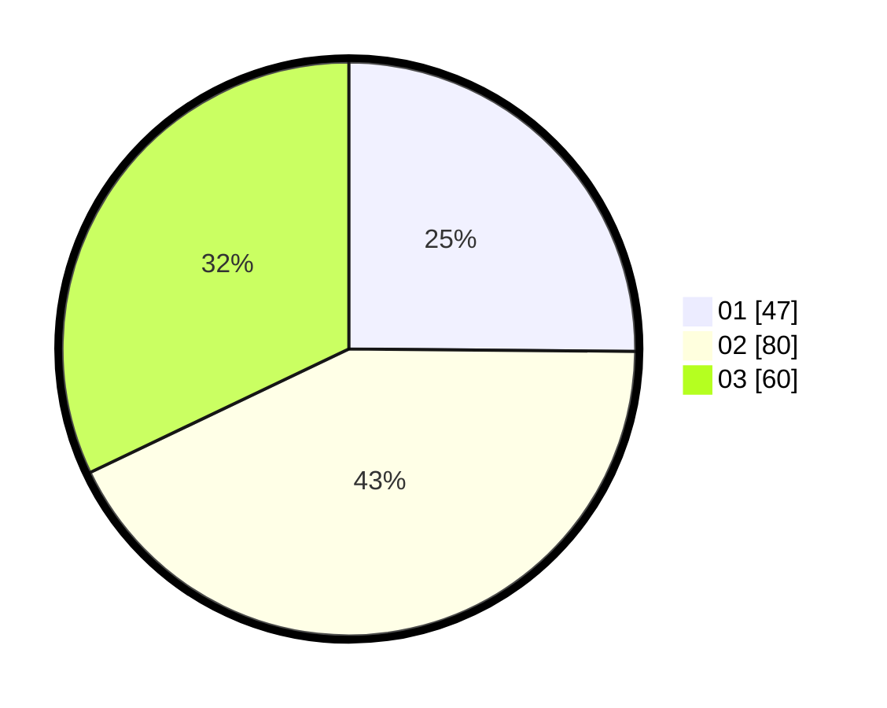

# Hasil

Hasil perolehan suara paslon dapat dilihat pada file paslon-01.txt, paslon-02.txt, dan paslon-03.txt.

Jika tidak ada, artinya data tersebut belum ada pada SIREKAP.

## Perolehan Suara

 * Paslon 01: **47**.
 * Paslon 02: **80**.
 * Paslon 03: **60**.

## Foto C Plano

https://sirekap-obj-formc.kpu.go.id/d6ec/pemilu/ppwp/31/73/04/10/03/3173041003004-20240214-231247--57d6719c-95cc-4a67-8075-793480af1df5.jpg

https://sirekap-obj-formc.kpu.go.id/d6ec/pemilu/ppwp/31/73/04/10/03/3173041003004-20240214-231324--8c06dba5-e5ca-494c-916f-f807e1233fac.jpg

https://sirekap-obj-formc.kpu.go.id/d6ec/pemilu/ppwp/31/73/04/10/03/3173041003004-20240214-231355--383314de-4285-4be9-919c-912587d9bc78.jpg
