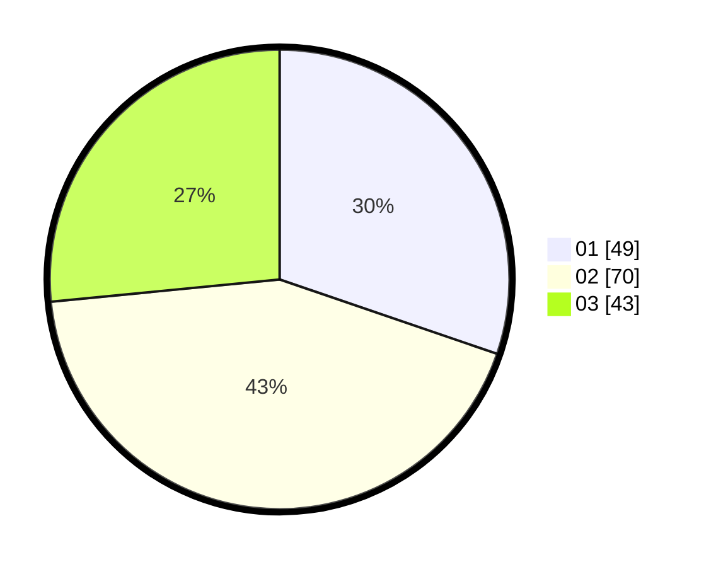

# Hasil

Hasil perolehan suara paslon dapat dilihat pada file paslon-01.txt, paslon-02.txt, dan paslon-03.txt.

Jika tidak ada, artinya data tersebut belum ada pada SIREKAP.

## Perolehan Suara

 * Paslon 01: **49**.
 * Paslon 02: **70**.
 * Paslon 03: **43**.

## Foto C Plano

https://sirekap-obj-formc.kpu.go.id/09aa/pemilu/ppwp/31/73/04/10/03/3173041003007-20240214-223116--1714606e-30d4-481e-a78d-c21391467bab.jpg

https://sirekap-obj-formc.kpu.go.id/09aa/pemilu/ppwp/31/73/04/10/03/3173041003007-20240217-202320--db38d85f-d685-42d5-af12-e4593b6bc076.jpg

https://sirekap-obj-formc.kpu.go.id/09aa/pemilu/ppwp/31/73/04/10/03/3173041003007-20240214-224216--7cd4bfeb-994f-4935-82a0-6acf711e6c7e.jpg
