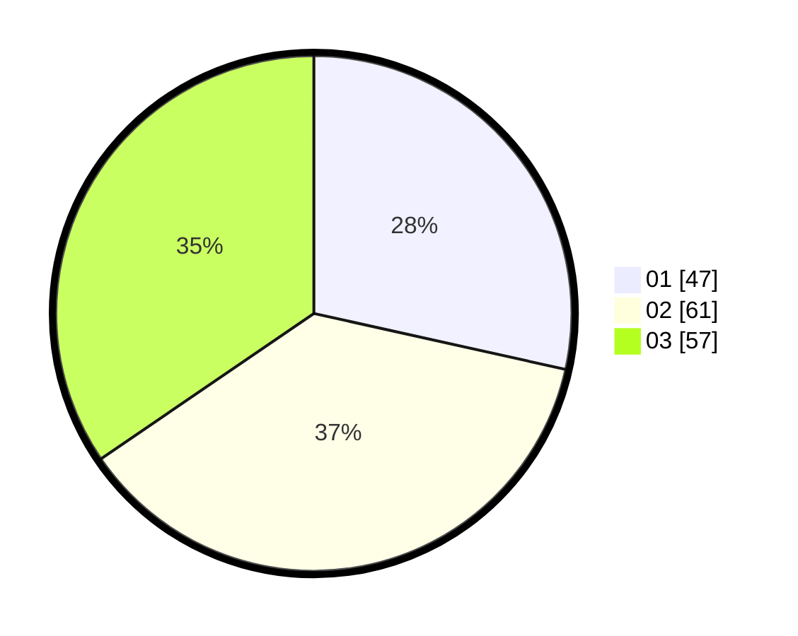

# Hasil

Hasil perolehan suara paslon dapat dilihat pada file paslon-01.txt, paslon-02.txt, dan paslon-03.txt.

Jika tidak ada, artinya data tersebut belum ada pada SIREKAP.

## Perolehan Suara

 * Paslon 01: **47**.
 * Paslon 02: **61**.
 * Paslon 03: **57**.

## Foto C Plano

https://sirekap-obj-formc.kpu.go.id/31da/pemilu/ppwp/31/73/04/10/03/3173041003008-20240214-214739--4472a699-4f1f-453d-bb27-b92b6304bb31.jpg

https://sirekap-obj-formc.kpu.go.id/31da/pemilu/ppwp/31/73/04/10/03/3173041003008-20240214-214949--fdf51141-9982-475f-a7a2-a8e2bcfa5ef8.jpg

https://sirekap-obj-formc.kpu.go.id/31da/pemilu/ppwp/31/73/04/10/03/3173041003008-20240214-215051--1b8a0a33-d6bd-46e3-bec6-81f45fdb8818.jpg
