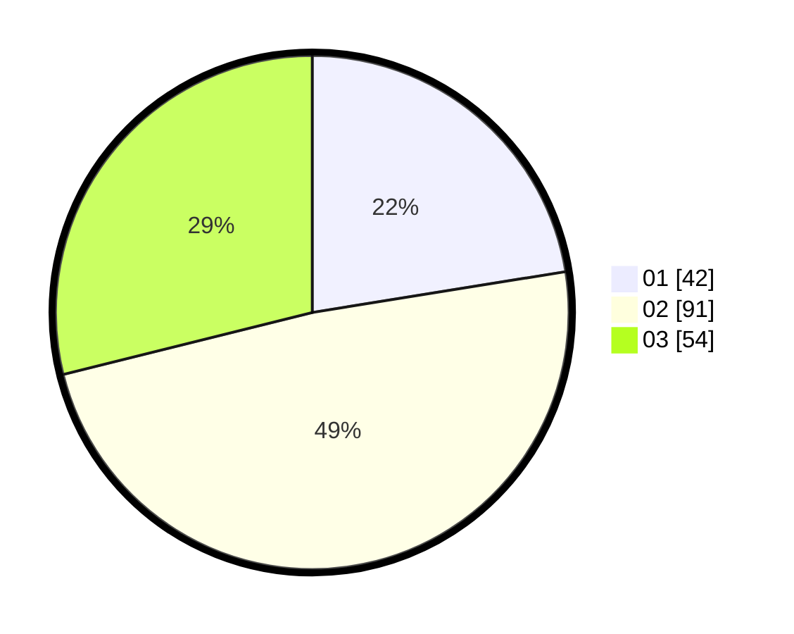

# Hasil

Hasil perolehan suara paslon dapat dilihat pada file paslon-01.txt, paslon-02.txt, dan paslon-03.txt.

Jika tidak ada, artinya data tersebut belum ada pada SIREKAP.

## Perolehan Suara

 * Paslon 01: **42**.
 * Paslon 02: **91**.
 * Paslon 03: **54**.

## Foto C Plano

https://sirekap-obj-formc.kpu.go.id/e1f2/pemilu/ppwp/31/73/04/10/03/3173041003012-20240214-193347--e53c9f15-8e0e-4528-817a-18f2788b44e1.jpg

https://sirekap-obj-formc.kpu.go.id/e1f2/pemilu/ppwp/31/73/04/10/03/3173041003012-20240214-193443--e8602df1-5021-4155-a817-aa7e0687599e.jpg

https://sirekap-obj-formc.kpu.go.id/e1f2/pemilu/ppwp/31/73/04/10/03/3173041003012-20240214-193537--41199064-66c6-4a28-aa25-372bc5184581.jpg
