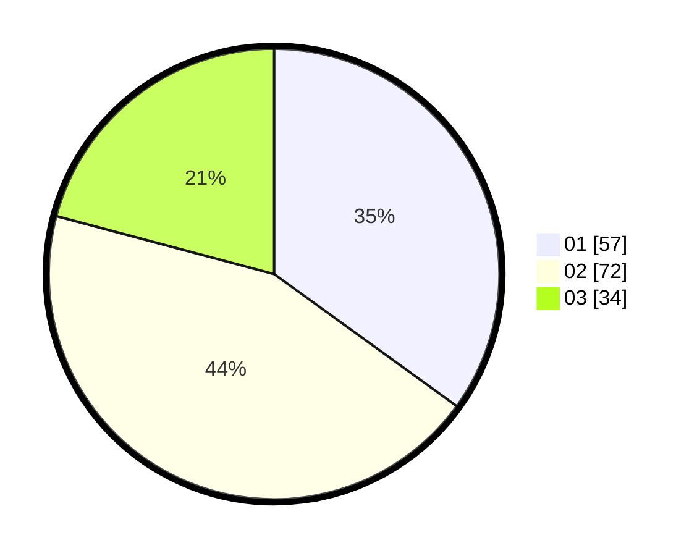

# Hasil

Hasil perolehan suara paslon dapat dilihat pada file paslon-01.txt, paslon-02.txt, dan paslon-03.txt.

Jika tidak ada, artinya data tersebut belum ada pada SIREKAP.

## Perolehan Suara

 * Paslon 01: **57**.
 * Paslon 02: **72**.
 * Paslon 03: **34**.

## Foto C Plano

https://sirekap-obj-formc.kpu.go.id/438c/pemilu/ppwp/31/73/04/10/03/3173041003014-20240214-221147--a420a5a3-9184-466c-962c-9b165a8368fa.jpg

https://sirekap-obj-formc.kpu.go.id/438c/pemilu/ppwp/31/73/04/10/03/3173041003014-20240214-221225--5aaeab13-0d56-41f3-bbea-e6fd24943ed7.jpg

https://sirekap-obj-formc.kpu.go.id/438c/pemilu/ppwp/31/73/04/10/03/3173041003014-20240214-221241--f4fbc5ca-c604-4a57-b488-dea6fd61d527.jpg
