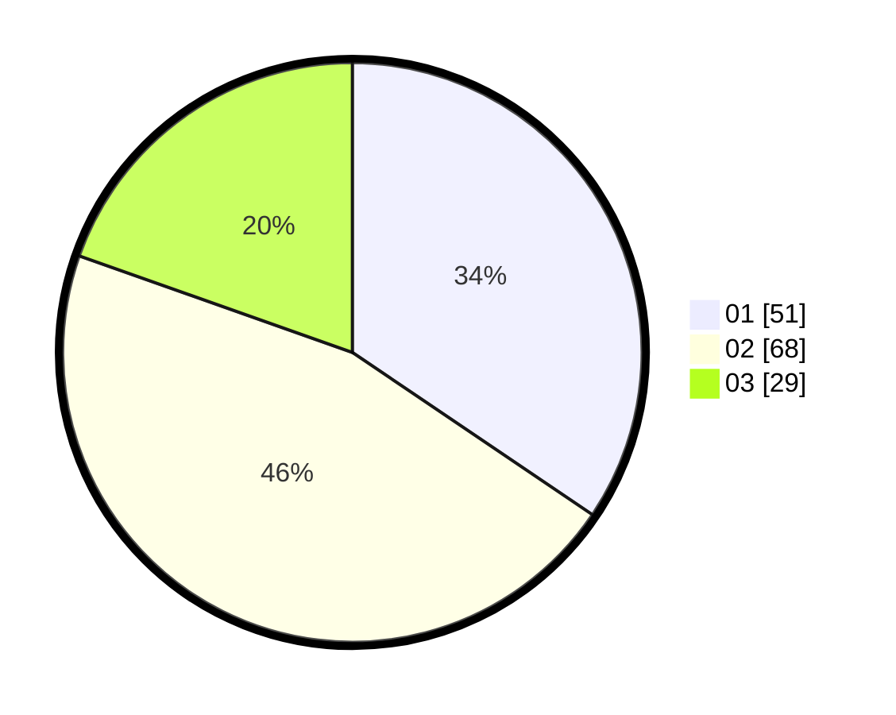

# Hasil

Hasil perolehan suara paslon dapat dilihat pada file paslon-01.txt, paslon-02.txt, dan paslon-03.txt.

Jika tidak ada, artinya data tersebut belum ada pada SIREKAP.

## Perolehan Suara

 * Paslon 01: **51**.
 * Paslon 02: **68**.
 * Paslon 03: **29**.

## Foto C Plano

https://sirekap-obj-formc.kpu.go.id/2687/pemilu/ppwp/31/73/04/10/03/3173041003016-20240215-234712--b6ec0a42-f54d-4b3c-8fe5-053f9e0af6c4.jpg

https://sirekap-obj-formc.kpu.go.id/2687/pemilu/ppwp/31/73/04/10/03/3173041003016-20240215-234714--24a64fa0-78b1-48c2-852a-0b02ea7fdc6b.jpg

https://sirekap-obj-formc.kpu.go.id/2687/pemilu/ppwp/31/73/04/10/03/3173041003016-20240215-234713--bdbbec16-4c01-463b-b3eb-eebe23a10616.jpg

## DATA PEMILIH TETAP

Jumlah pemilih dalam DPT: **247**.
 * L: **129**.
 * P: **118**.

## DATA PENGGUNA HAK PILIH

Jumlah pengguna hak pilih dalam DPT: **147**.
 * L: **71**.
 * P: **76**.

Jumlah pengguna hak pilih dalam DPTb: **1**.
 * L: **0**.
 * P: **1**.

Jumlah pengguna hak pilih dalam DPK: **0**.
 * L: **0**.
 * P: **0**.

Jumlah pengguna hak pilih: **148**.
 * L: **71**.
 * P: **77**.

## JUMLAH SUARA SAH DAN TIDAK SAH

JUMLAH SELURUH SUARA SAH: **148**.

JUMLAH SUARA TIDAK SAH: **0**.

JUMLAH SELURUH SUARA SAH DAN SUARA TIDAK SAH: **148**.
