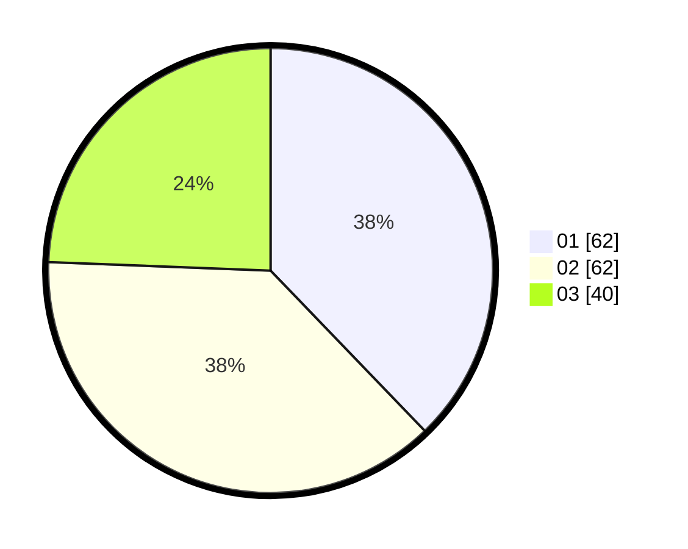

# Hasil

Hasil perolehan suara paslon dapat dilihat pada file paslon-01.txt, paslon-02.txt, dan paslon-03.txt.

Jika tidak ada, artinya data tersebut belum ada pada SIREKAP.

## Perolehan Suara

 * Paslon 01: **62**.
 * Paslon 02: **62**.
 * Paslon 03: **40**.

## Foto C Plano

https://sirekap-obj-formc.kpu.go.id/36b8/pemilu/ppwp/31/73/04/10/03/3173041003017-20240214-194139--6f5c098c-46c2-4512-a620-25563fe3ff0d.jpg

https://sirekap-obj-formc.kpu.go.id/36b8/pemilu/ppwp/31/73/04/10/03/3173041003017-20240214-194216--710fde6a-9061-412c-8402-119d4f4bc839.jpg

https://sirekap-obj-formc.kpu.go.id/36b8/pemilu/ppwp/31/73/04/10/03/3173041003017-20240214-194209--46732bf1-43e8-403d-abd4-c5268bf5bf88.jpg
