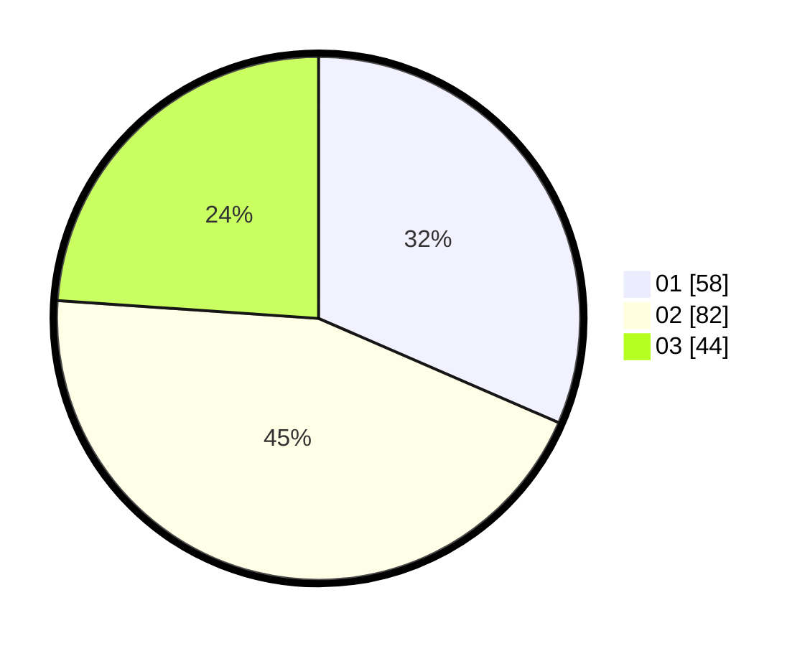

# Hasil

Hasil perolehan suara paslon dapat dilihat pada file paslon-01.txt, paslon-02.txt, dan paslon-03.txt.

Jika tidak ada, artinya data tersebut belum ada pada SIREKAP.

## Perolehan Suara

 * Paslon 01: **58**.
 * Paslon 02: **82**.
 * Paslon 03: **44**.

## Foto C Plano

https://sirekap-obj-formc.kpu.go.id/2fe6/pemilu/ppwp/31/73/04/10/03/3173041003019-20240214-230709--8f43b113-19db-4144-a1be-b7ef61e6c736.jpg

https://sirekap-obj-formc.kpu.go.id/2fe6/pemilu/ppwp/31/73/04/10/03/3173041003019-20240214-230619--95c8bea1-2e98-46d5-9e2b-84ed29ef3e6e.jpg

https://sirekap-obj-formc.kpu.go.id/2fe6/pemilu/ppwp/31/73/04/10/03/3173041003019-20240214-230515--2dfc1199-7429-4265-9ad6-4c071c7f021b.jpg
