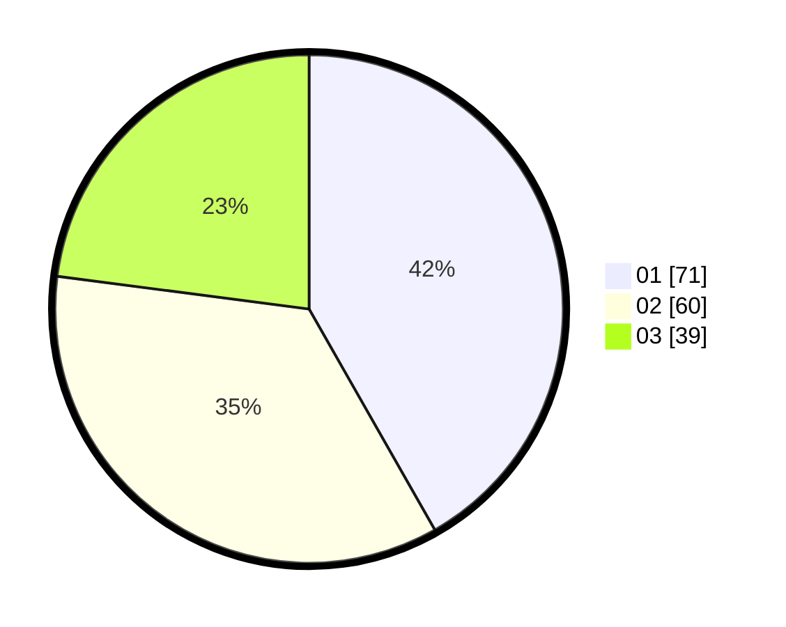

# Hasil

Hasil perolehan suara paslon dapat dilihat pada file paslon-01.txt, paslon-02.txt, dan paslon-03.txt.

Jika tidak ada, artinya data tersebut belum ada pada SIREKAP.

## Perolehan Suara

 * Paslon 01: **71**.
 * Paslon 02: **60**.
 * Paslon 03: **39**.

## Foto C Plano

https://sirekap-obj-formc.kpu.go.id/6446/pemilu/ppwp/31/73/04/10/03/3173041003024-20240216-195846--a4b70473-a3b2-4fc2-97db-ba6debedeb8a.jpg

https://sirekap-obj-formc.kpu.go.id/6446/pemilu/ppwp/31/73/04/10/03/3173041003024-20240216-200459--7d5cf93f-4432-45c0-b0f6-f0238c17d01f.jpg

https://sirekap-obj-formc.kpu.go.id/6446/pemilu/ppwp/31/73/04/10/03/3173041003024-20240216-200549--f9afed9b-0744-44cf-82c8-3bdb1cadead4.jpg

## DATA PEMILIH TETAP

Jumlah pemilih dalam DPT: **211**.
 * L: **108**.
 * P: **103**.

## DATA PENGGUNA HAK PILIH

Jumlah pengguna hak pilih dalam DPT: **171**.
 * L: **88**.
 * P: **83**.

Jumlah pengguna hak pilih dalam DPTb: **0**.
 * L: **0**.
 * P: **0**.

Jumlah pengguna hak pilih dalam DPK: **0**.
 * L: **0**.
 * P: **0**.

Jumlah pengguna hak pilih: **171**.
 * L: **88**.
 * P: **83**.

## JUMLAH SUARA SAH DAN TIDAK SAH

JUMLAH SELURUH SUARA SAH: **170**.

JUMLAH SUARA TIDAK SAH: **1**.

JUMLAH SELURUH SUARA SAH DAN SUARA TIDAK SAH: **171**.
