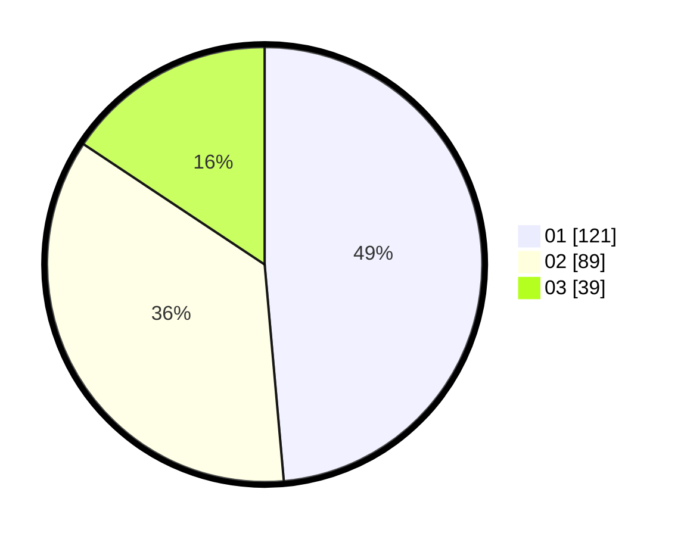

# Hasil

Hasil perolehan suara paslon dapat dilihat pada file paslon-01.txt, paslon-02.txt, dan paslon-03.txt.

Jika tidak ada, artinya data tersebut belum ada pada SIREKAP.

## Perolehan Suara

 * Paslon 01: **121**.
 * Paslon 02: **89**.
 * Paslon 03: **39**.

## Foto C Plano

https://sirekap-obj-formc.kpu.go.id/84c4/pemilu/ppwp/31/73/04/10/03/3173041003026-20240216-164317--a4faea91-27f9-4ec6-aa18-1268b8eeb20a.jpg

https://sirekap-obj-formc.kpu.go.id/84c4/pemilu/ppwp/31/73/04/10/03/3173041003026-20240215-133735--5057fdc2-1d59-4526-9332-21ad5c418e8e.jpg

https://sirekap-obj-formc.kpu.go.id/84c4/pemilu/ppwp/31/73/04/10/03/3173041003026-20240215-133807--37d5abdd-a459-42f0-9c21-c8a42d4a552f.jpg
