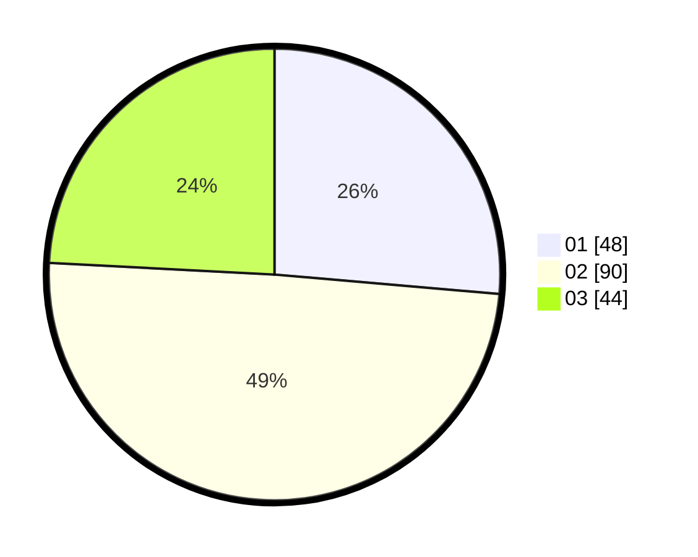

# Hasil

Hasil perolehan suara paslon dapat dilihat pada file paslon-01.txt, paslon-02.txt, dan paslon-03.txt.

Jika tidak ada, artinya data tersebut belum ada pada SIREKAP.

## Perolehan Suara

 * Paslon 01: **48**.
 * Paslon 02: **90**.
 * Paslon 03: **44**.

## Foto C Plano

https://sirekap-obj-formc.kpu.go.id/bd1b/pemilu/ppwp/31/73/04/10/03/3173041003027-20240214-205329--afde1c8f-38b5-4d04-bea1-ce61e8865ae8.jpg

https://sirekap-obj-formc.kpu.go.id/bd1b/pemilu/ppwp/31/73/04/10/03/3173041003027-20240216-142452--f4559a1a-bc42-44c8-9f23-481d42a4c730.jpg

https://sirekap-obj-formc.kpu.go.id/bd1b/pemilu/ppwp/31/73/04/10/03/3173041003027-20240214-205216--c67c7873-d300-4d3b-a97e-b40186d4cf08.jpg

## DATA PEMILIH TETAP

Jumlah pemilih dalam DPT: **260**.
 * L: **124**.
 * P: **136**.

## DATA PENGGUNA HAK PILIH

Jumlah pengguna hak pilih dalam DPT: **181**.
 * L: **86**.
 * P: **95**.

Jumlah pengguna hak pilih dalam DPTb: **1**.
 * L: **1**.
 * P: **0**.

Jumlah pengguna hak pilih dalam DPK: **3**.
 * L: **1**.
 * P: **2**.

Jumlah pengguna hak pilih: **185**.
 * L: **88**.
 * P: **97**.

## JUMLAH SUARA SAH DAN TIDAK SAH

JUMLAH SELURUH SUARA SAH: **182**.

JUMLAH SUARA TIDAK SAH: **3**.

JUMLAH SELURUH SUARA SAH DAN SUARA TIDAK SAH: **185**.
