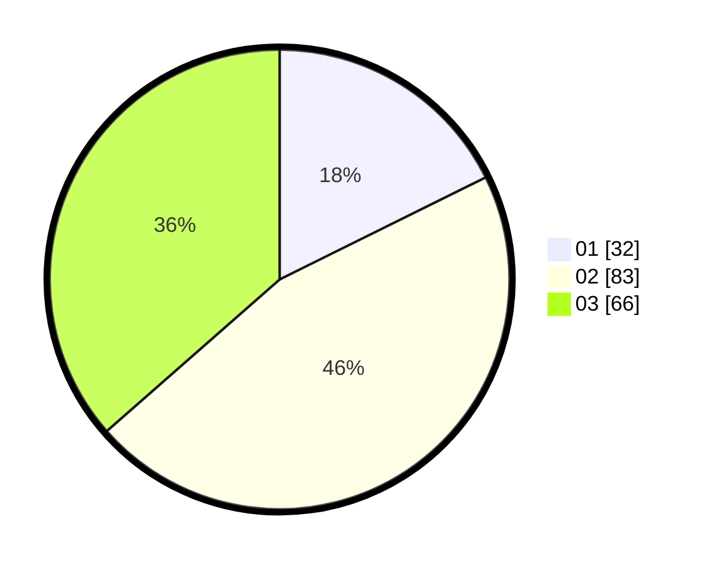

# Hasil

Hasil perolehan suara paslon dapat dilihat pada file paslon-01.txt, paslon-02.txt, dan paslon-03.txt.

Jika tidak ada, artinya data tersebut belum ada pada SIREKAP.

## Perolehan Suara

 * Paslon 01: **32**.
 * Paslon 02: **83**.
 * Paslon 03: **66**.

## Foto C Plano

https://sirekap-obj-formc.kpu.go.id/845a/pemilu/ppwp/31/73/04/10/03/3173041003028-20240214-155317--de96b57f-9a9a-410c-bc75-0642e98d5510.jpg

https://sirekap-obj-formc.kpu.go.id/845a/pemilu/ppwp/31/73/04/10/03/3173041003028-20240214-160055--a4434dc4-480b-4530-acc3-a12b5399a668.jpg

https://sirekap-obj-formc.kpu.go.id/845a/pemilu/ppwp/31/73/04/10/03/3173041003028-20240214-160055--5012ae3a-6575-4c61-ae45-df99fe216697.jpg

## DATA PEMILIH TETAP

Jumlah pemilih dalam DPT: **285**.
 * L: **142**.
 * P: **143**.

## DATA PENGGUNA HAK PILIH

Jumlah pengguna hak pilih dalam DPT: **179**.
 * L: **89**.
 * P: **90**.

Jumlah pengguna hak pilih dalam DPTb: **1**.
 * L: **1**.
 * P: **0**.

Jumlah pengguna hak pilih dalam DPK: **3**.
 * L: **2**.
 * P: **1**.

Jumlah pengguna hak pilih: **183**.
 * L: **92**.
 * P: **91**.

## JUMLAH SUARA SAH DAN TIDAK SAH

JUMLAH SELURUH SUARA SAH: **181**.

JUMLAH SUARA TIDAK SAH: **2**.

JUMLAH SELURUH SUARA SAH DAN SUARA TIDAK SAH: **183**.
