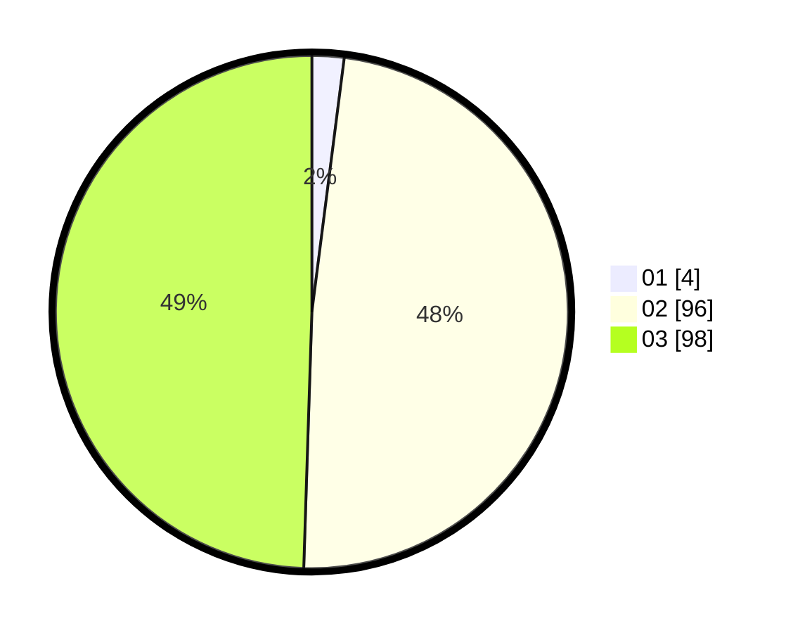

# Hasil

Hasil perolehan suara paslon dapat dilihat pada file paslon-01.txt, paslon-02.txt, dan paslon-03.txt.

Jika tidak ada, artinya data tersebut belum ada pada SIREKAP.

## Perolehan Suara

 * Paslon 01: **4**.
 * Paslon 02: **96**.
 * Paslon 03: **98**.

## Foto C Plano

https://sirekap-obj-formc.kpu.go.id/cce5/pemilu/ppwp/31/73/04/10/03/3173041003029-20240214-221426--1f4dbe0a-3c76-41a8-9984-3314050e6901.jpg

https://sirekap-obj-formc.kpu.go.id/cce5/pemilu/ppwp/31/73/04/10/03/3173041003029-20240214-221350--f4896144-2b96-482e-a167-b5532830c62a.jpg

https://sirekap-obj-formc.kpu.go.id/cce5/pemilu/ppwp/31/73/04/10/03/3173041003029-20240214-221240--874d3282-9d54-4f1c-829e-fdd62f8cab5d.jpg
