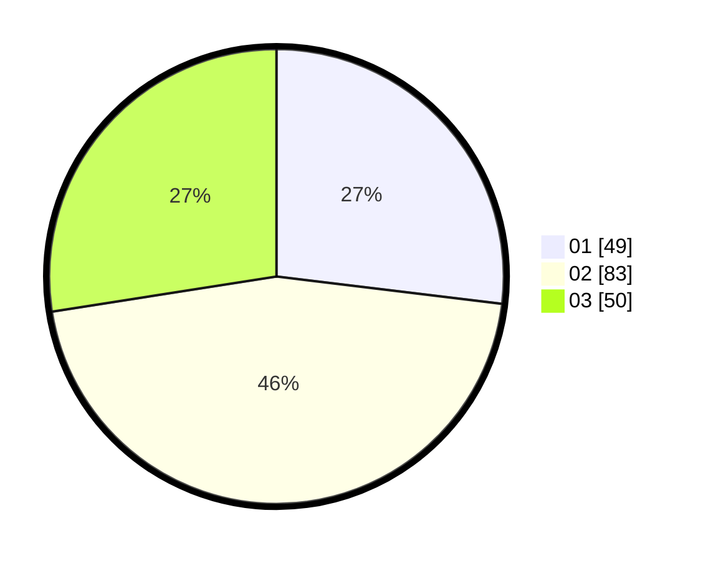

# Hasil

Hasil perolehan suara paslon dapat dilihat pada file paslon-01.txt, paslon-02.txt, dan paslon-03.txt.

Jika tidak ada, artinya data tersebut belum ada pada SIREKAP.

## Perolehan Suara

 * Paslon 01: **49**.
 * Paslon 02: **83**.
 * Paslon 03: **50**.

## Foto C Plano

https://sirekap-obj-formc.kpu.go.id/42d4/pemilu/ppwp/31/73/04/10/03/3173041003034-20240214-175322--c15b1c89-4ffe-4ab1-ae0f-2ff5624231d7.jpg

https://sirekap-obj-formc.kpu.go.id/42d4/pemilu/ppwp/31/73/04/10/03/3173041003034-20240214-231849--b5416395-e088-4e92-ac87-a80af4247502.jpg

https://sirekap-obj-formc.kpu.go.id/42d4/pemilu/ppwp/31/73/04/10/03/3173041003034-20240214-175734--b42908f3-257c-4c39-85fc-aacbf8c3f8f4.jpg

## DATA PEMILIH TETAP

Jumlah pemilih dalam DPT: **275**.
 * L: **145**.
 * P: **130**.

## DATA PENGGUNA HAK PILIH

Jumlah pengguna hak pilih dalam DPT: **183**.
 * L: **90**.
 * P: **93**.

Jumlah pengguna hak pilih dalam DPTb: **0**.
 * L: **0**.
 * P: **0**.

Jumlah pengguna hak pilih dalam DPK: **1**.
 * L: **0**.
 * P: **1**.

Jumlah pengguna hak pilih: **184**.
 * L: **90**.
 * P: **94**.

## JUMLAH SUARA SAH DAN TIDAK SAH

JUMLAH SELURUH SUARA SAH: **182**.

JUMLAH SUARA TIDAK SAH: **2**.

JUMLAH SELURUH SUARA SAH DAN SUARA TIDAK SAH: **184**.
