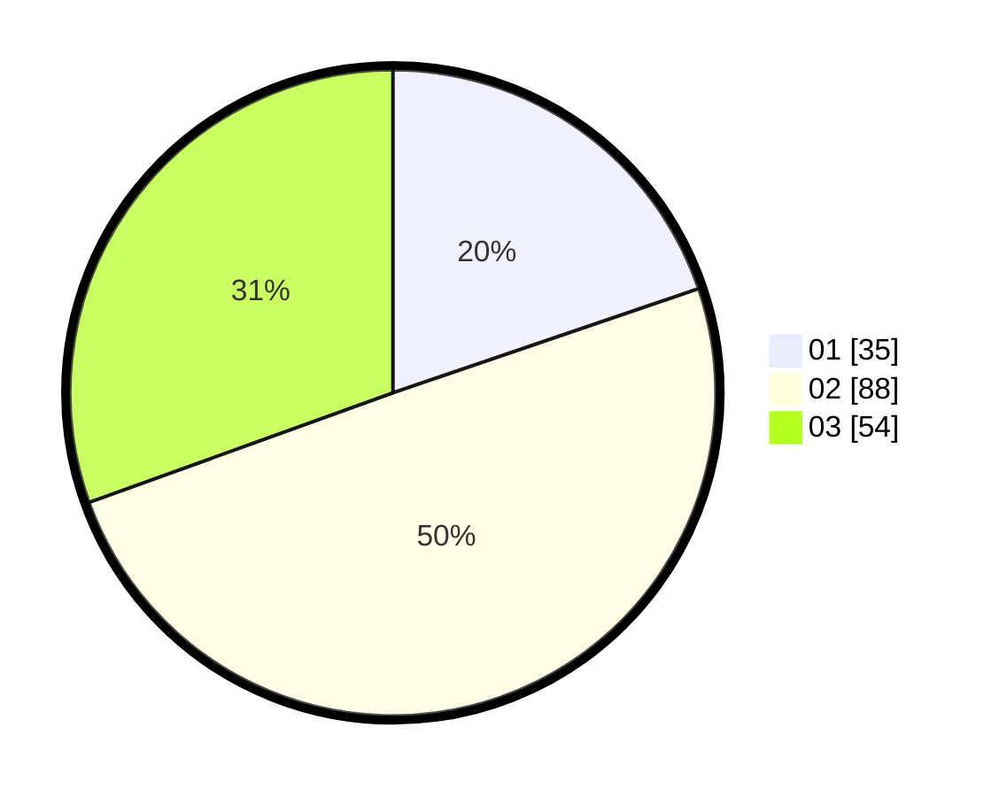

# Hasil

Hasil perolehan suara paslon dapat dilihat pada file paslon-01.txt, paslon-02.txt, dan paslon-03.txt.

Jika tidak ada, artinya data tersebut belum ada pada SIREKAP.

## Perolehan Suara

 * Paslon 01: **35**.
 * Paslon 02: **88**.
 * Paslon 03: **54**.

## Foto C Plano

https://sirekap-obj-formc.kpu.go.id/49f3/pemilu/ppwp/31/73/04/10/03/3173041003042-20240214-193415--12e25801-e193-4f13-9d94-9b5b90247f9e.jpg

https://sirekap-obj-formc.kpu.go.id/49f3/pemilu/ppwp/31/73/04/10/03/3173041003042-20240214-195024--7068cd2d-90c6-4e8f-bdf0-4a9129c63654.jpg

https://sirekap-obj-formc.kpu.go.id/49f3/pemilu/ppwp/31/73/04/10/03/3173041003042-20240214-195216--e1957ed4-f5e1-4963-8a94-173f84f5d0cb.jpg

## DATA PEMILIH TETAP

Jumlah pemilih dalam DPT: **265**.
 * L: **129**.
 * P: **136**.

## DATA PENGGUNA HAK PILIH

Jumlah pengguna hak pilih dalam DPT: **172**.
 * L: **82**.
 * P: **90**.

Jumlah pengguna hak pilih dalam DPTb: **6**.
 * L: **3**.
 * P: **3**.

Jumlah pengguna hak pilih dalam DPK: **0**.
 * L: **0**.
 * P: **0**.

Jumlah pengguna hak pilih: **178**.
 * L: **85**.
 * P: **93**.

## JUMLAH SUARA SAH DAN TIDAK SAH

JUMLAH SELURUH SUARA SAH: **177**.

JUMLAH SUARA TIDAK SAH: **1**.

JUMLAH SELURUH SUARA SAH DAN SUARA TIDAK SAH: **178**.
