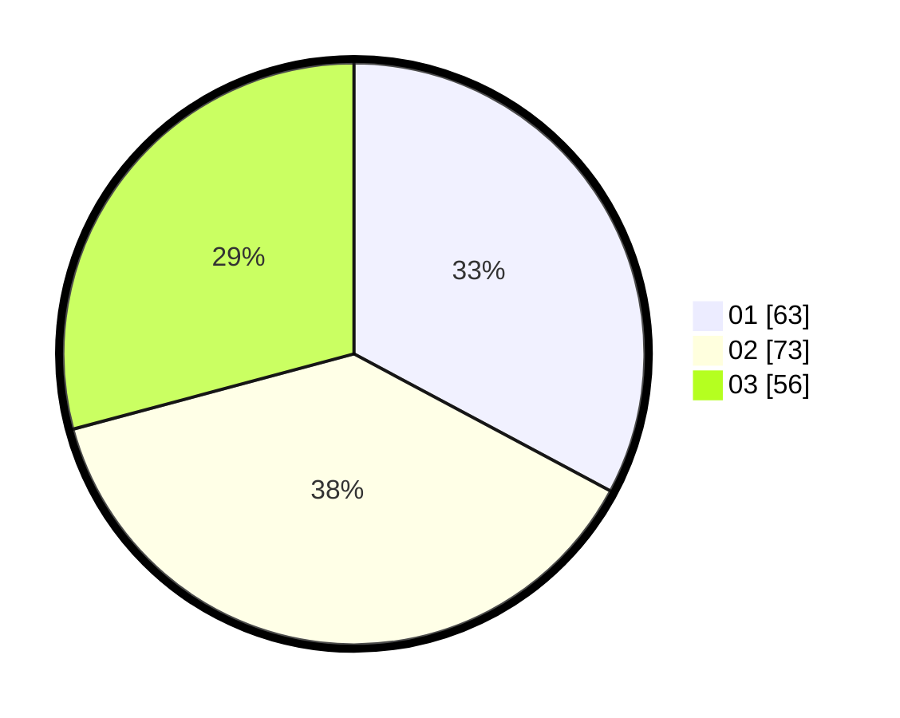

# Hasil

Hasil perolehan suara paslon dapat dilihat pada file paslon-01.txt, paslon-02.txt, dan paslon-03.txt.

Jika tidak ada, artinya data tersebut belum ada pada SIREKAP.

## Perolehan Suara

 * Paslon 01: **63**.
 * Paslon 02: **73**.
 * Paslon 03: **56**.

## Foto C Plano

https://sirekap-obj-formc.kpu.go.id/4b8e/pemilu/ppwp/31/73/04/10/03/3173041003046-20240214-213245--08480382-973a-44bf-b154-534394da2cb7.jpg

https://sirekap-obj-formc.kpu.go.id/4b8e/pemilu/ppwp/31/73/04/10/03/3173041003046-20240214-220557--e025163b-b96b-43fe-8371-98ba3898edc8.jpg

https://sirekap-obj-formc.kpu.go.id/4b8e/pemilu/ppwp/31/73/04/10/03/3173041003046-20240214-220808--f72850b4-66fe-414f-8189-829fd1cb8710.jpg
