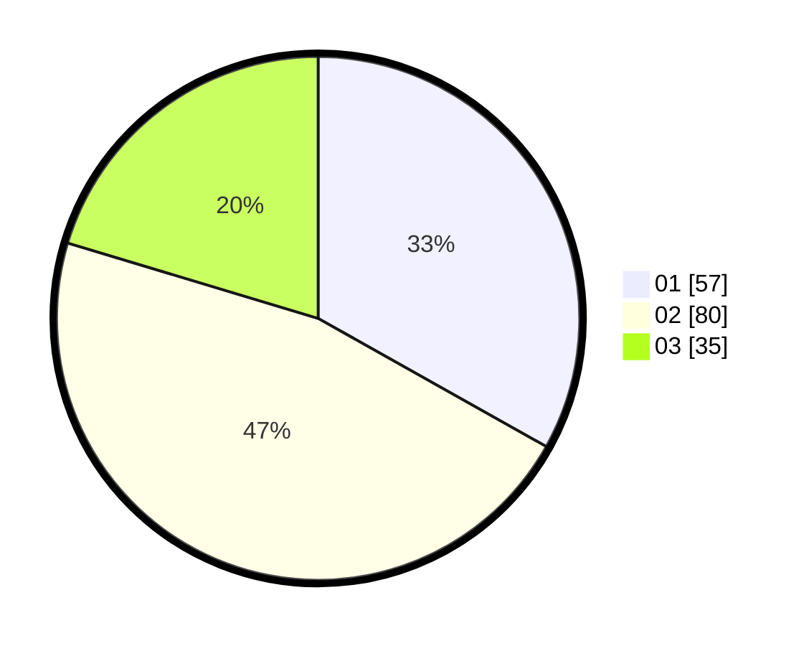

# Hasil

Hasil perolehan suara paslon dapat dilihat pada file paslon-01.txt, paslon-02.txt, dan paslon-03.txt.

Jika tidak ada, artinya data tersebut belum ada pada SIREKAP.

## Perolehan Suara

 * Paslon 01: **57**.
 * Paslon 02: **80**.
 * Paslon 03: **35**.

## Foto C Plano

https://sirekap-obj-formc.kpu.go.id/4312/pemilu/ppwp/31/73/04/10/03/3173041003055-20240214-211204--135f882c-dedf-4d74-9f5b-90935d70fee0.jpg

https://sirekap-obj-formc.kpu.go.id/4312/pemilu/ppwp/31/73/04/10/03/3173041003055-20240214-211432--250a07b0-376b-418e-b336-3017cb55d195.jpg

https://sirekap-obj-formc.kpu.go.id/4312/pemilu/ppwp/31/73/04/10/03/3173041003055-20240214-211557--3c96e1ba-9778-42f1-98f1-fc91006dc80b.jpg
