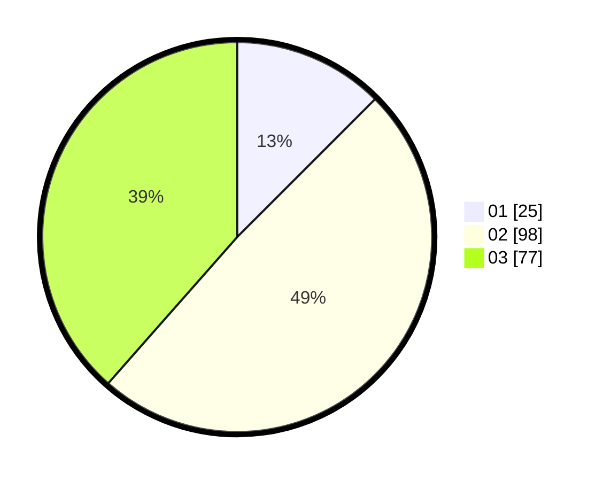

# Hasil

Hasil perolehan suara paslon dapat dilihat pada file paslon-01.txt, paslon-02.txt, dan paslon-03.txt.

Jika tidak ada, artinya data tersebut belum ada pada SIREKAP.

## Perolehan Suara

 * Paslon 01: **25**.
 * Paslon 02: **98**.
 * Paslon 03: **77**.

## Foto C Plano

https://sirekap-obj-formc.kpu.go.id/1442/pemilu/ppwp/31/73/04/10/03/3173041003058-20240215-004239--417d6823-388a-44e7-a758-6113e8e4b3cb.jpg

https://sirekap-obj-formc.kpu.go.id/1442/pemilu/ppwp/31/73/04/10/03/3173041003058-20240215-000753--1c117585-565d-49c8-9907-0ba9d61f79e2.jpg

https://sirekap-obj-formc.kpu.go.id/1442/pemilu/ppwp/31/73/04/10/03/3173041003058-20240215-000900--417dcdf6-66c3-4233-9c71-9c8a9a828bcc.jpg
