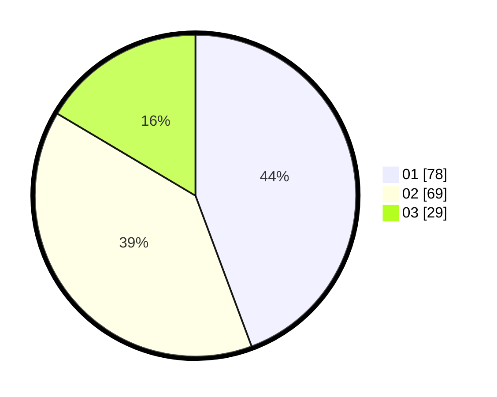

# Hasil

Hasil perolehan suara paslon dapat dilihat pada file paslon-01.txt, paslon-02.txt, dan paslon-03.txt.

Jika tidak ada, artinya data tersebut belum ada pada SIREKAP.

## Perolehan Suara

 * Paslon 01: **78**.
 * Paslon 02: **69**.
 * Paslon 03: **29**.

## Foto C Plano

https://sirekap-obj-formc.kpu.go.id/2c0f/pemilu/ppwp/31/73/04/10/03/3173041003060-20240214-215930--fe514c48-9df1-4267-b5d2-3de526e5f7d5.jpg

https://sirekap-obj-formc.kpu.go.id/2c0f/pemilu/ppwp/31/73/04/10/03/3173041003060-20240214-220048--9a3f3193-071e-4fca-b928-e365368b5640.jpg

https://sirekap-obj-formc.kpu.go.id/2c0f/pemilu/ppwp/31/73/04/10/03/3173041003060-20240214-220206--2e6596a3-3e01-419d-aebf-2d8e15172478.jpg
