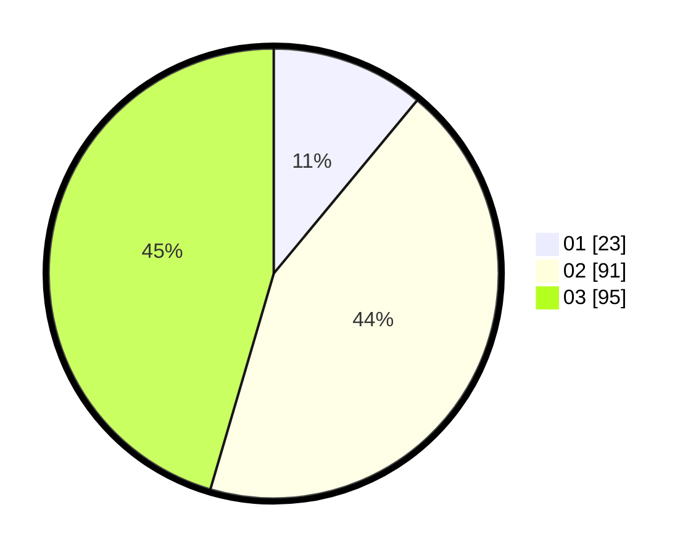

# Hasil

Hasil perolehan suara paslon dapat dilihat pada file paslon-01.txt, paslon-02.txt, dan paslon-03.txt.

Jika tidak ada, artinya data tersebut belum ada pada SIREKAP.

## Perolehan Suara

 * Paslon 01: **23**.
 * Paslon 02: **91**.
 * Paslon 03: **95**.

## Foto C Plano

https://sirekap-obj-formc.kpu.go.id/b3e9/pemilu/ppwp/31/73/04/10/03/3173041003062-20240214-193122--6cd38a85-d98b-451d-b71c-7e2c2632c567.jpg

https://sirekap-obj-formc.kpu.go.id/b3e9/pemilu/ppwp/31/73/04/10/03/3173041003062-20240214-193402--a0804349-021d-458a-a31d-366984d8804c.jpg

https://sirekap-obj-formc.kpu.go.id/b3e9/pemilu/ppwp/31/73/04/10/03/3173041003062-20240214-193510--a86cbff7-1ad3-402f-8451-326b73b3f5e2.jpg
