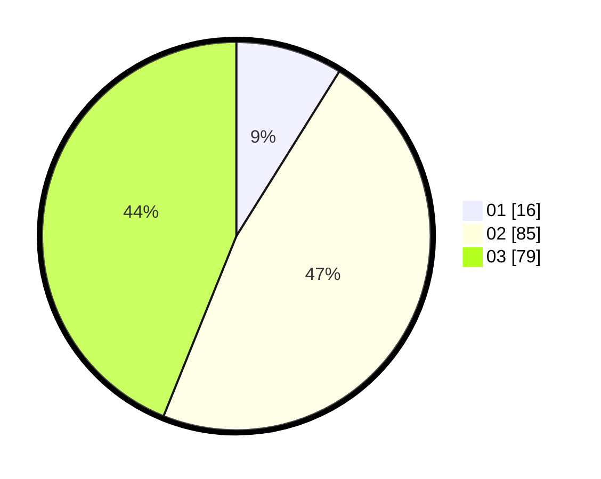

# Hasil

Hasil perolehan suara paslon dapat dilihat pada file paslon-01.txt, paslon-02.txt, dan paslon-03.txt.

Jika tidak ada, artinya data tersebut belum ada pada SIREKAP.

## Perolehan Suara

 * Paslon 01: **16**.
 * Paslon 02: **85**.
 * Paslon 03: **79**.

## Foto C Plano

https://sirekap-obj-formc.kpu.go.id/62b2/pemilu/ppwp/31/73/04/10/03/3173041003063-20240214-203513--d5601b59-24eb-421b-8f69-15b458069f9e.jpg

https://sirekap-obj-formc.kpu.go.id/62b2/pemilu/ppwp/31/73/04/10/03/3173041003063-20240214-204017--76126e46-8a91-4885-ba33-6089a494befb.jpg
