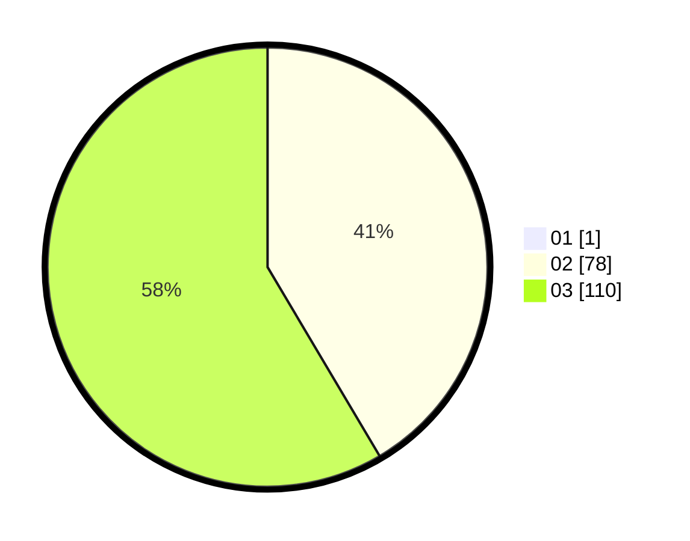

# Hasil

Hasil perolehan suara paslon dapat dilihat pada file paslon-01.txt, paslon-02.txt, dan paslon-03.txt.

Jika tidak ada, artinya data tersebut belum ada pada SIREKAP.

## Perolehan Suara

 * Paslon 01: **1**.
 * Paslon 02: **78**.
 * Paslon 03: **110**.

## Foto C Plano

https://sirekap-obj-formc.kpu.go.id/2ab1/pemilu/ppwp/31/73/04/10/03/3173041003064-20240214-155624--a70e530d-4a95-48a8-a1e8-f0bd0ab95689.jpg

https://sirekap-obj-formc.kpu.go.id/2ab1/pemilu/ppwp/31/73/04/10/03/3173041003064-20240214-185611--edb7b4f0-87b9-4ed3-8195-a851d90b2cdd.jpg

https://sirekap-obj-formc.kpu.go.id/2ab1/pemilu/ppwp/31/73/04/10/03/3173041003064-20240214-185846--c6a06318-b925-49df-980e-35dc0474f6ae.jpg

## DATA PEMILIH TETAP

Jumlah pemilih dalam DPT: **269**.
 * L: **139**.
 * P: **130**.

## DATA PENGGUNA HAK PILIH

Jumlah pengguna hak pilih dalam DPT: **188**.
 * L: **101**.
 * P: **87**.

Jumlah pengguna hak pilih dalam DPTb: **4**.
 * L: **2**.
 * P: **2**.

Jumlah pengguna hak pilih dalam DPK: **1**.
 * L: **1**.
 * P: **0**.

Jumlah pengguna hak pilih: **193**.
 * L: **104**.
 * P: **89**.

## JUMLAH SUARA SAH DAN TIDAK SAH

JUMLAH SELURUH SUARA SAH: **189**.

JUMLAH SUARA TIDAK SAH: **4**.

JUMLAH SELURUH SUARA SAH DAN SUARA TIDAK SAH: **193**.
