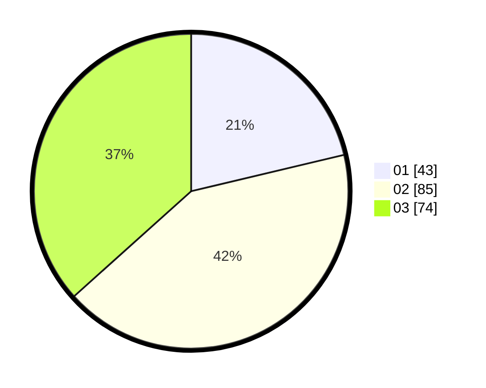

# Hasil

Hasil perolehan suara paslon dapat dilihat pada file paslon-01.txt, paslon-02.txt, dan paslon-03.txt.

Jika tidak ada, artinya data tersebut belum ada pada SIREKAP.

## Perolehan Suara

 * Paslon 01: **43**.
 * Paslon 02: **85**.
 * Paslon 03: **74**.

## Foto C Plano

https://sirekap-obj-formc.kpu.go.id/7ba2/pemilu/ppwp/31/73/04/10/03/3173041003065-20240215-023133--ef9c94d6-2453-42d9-907b-4bcbd81e79c4.jpg

https://sirekap-obj-formc.kpu.go.id/7ba2/pemilu/ppwp/31/73/04/10/03/3173041003065-20240215-023503--a9d1c67b-4c02-426d-8caa-70359fe36b2e.jpg

https://sirekap-obj-formc.kpu.go.id/7ba2/pemilu/ppwp/31/73/04/10/03/3173041003065-20240215-023910--e882f116-47cd-4c1e-b087-62284e2c805e.jpg
