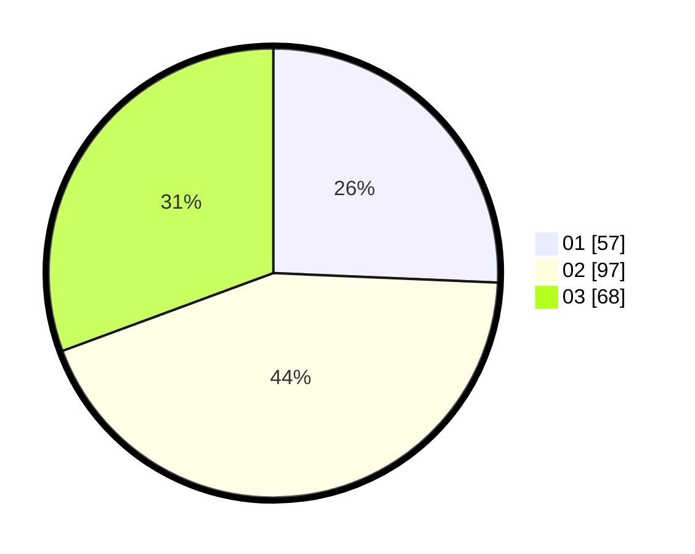

# Hasil

Hasil perolehan suara paslon dapat dilihat pada file paslon-01.txt, paslon-02.txt, dan paslon-03.txt.

Jika tidak ada, artinya data tersebut belum ada pada SIREKAP.

## Perolehan Suara

 * Paslon 01: **57**.
 * Paslon 02: **97**.
 * Paslon 03: **68**.

## Foto C Plano

https://sirekap-obj-formc.kpu.go.id/cf74/pemilu/ppwp/31/73/04/10/04/3173041004002-20240215-003647--274caac0-89c5-40c0-9410-9b5a168a93dc.jpg

https://sirekap-obj-formc.kpu.go.id/cf74/pemilu/ppwp/31/73/04/10/04/3173041004002-20240215-003907--dcd8fc90-8ee6-4c57-bf19-58779d44e68e.jpg

https://sirekap-obj-formc.kpu.go.id/cf74/pemilu/ppwp/31/73/04/10/04/3173041004002-20240215-003952--b25f8030-e6cb-4788-b2e6-95aec405d935.jpg
