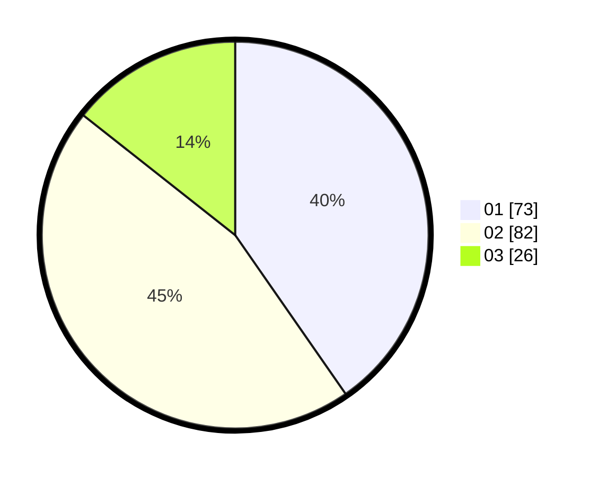

# Hasil

Hasil perolehan suara paslon dapat dilihat pada file paslon-01.txt, paslon-02.txt, dan paslon-03.txt.

Jika tidak ada, artinya data tersebut belum ada pada SIREKAP.

## Perolehan Suara

 * Paslon 01: **73**.
 * Paslon 02: **82**.
 * Paslon 03: **26**.

## Foto C Plano

https://sirekap-obj-formc.kpu.go.id/03b2/pemilu/ppwp/31/73/04/10/04/3173041004003-20240214-223210--aaedf948-139b-4b50-b70c-3082847305a5.jpg

https://sirekap-obj-formc.kpu.go.id/03b2/pemilu/ppwp/31/73/04/10/04/3173041004003-20240214-223449--084fbd96-be07-48b3-8800-f5326c512e0c.jpg

https://sirekap-obj-formc.kpu.go.id/03b2/pemilu/ppwp/31/73/04/10/04/3173041004003-20240214-223629--e46a6bee-0f33-49f6-bb3b-16107e9d4ab9.jpg
